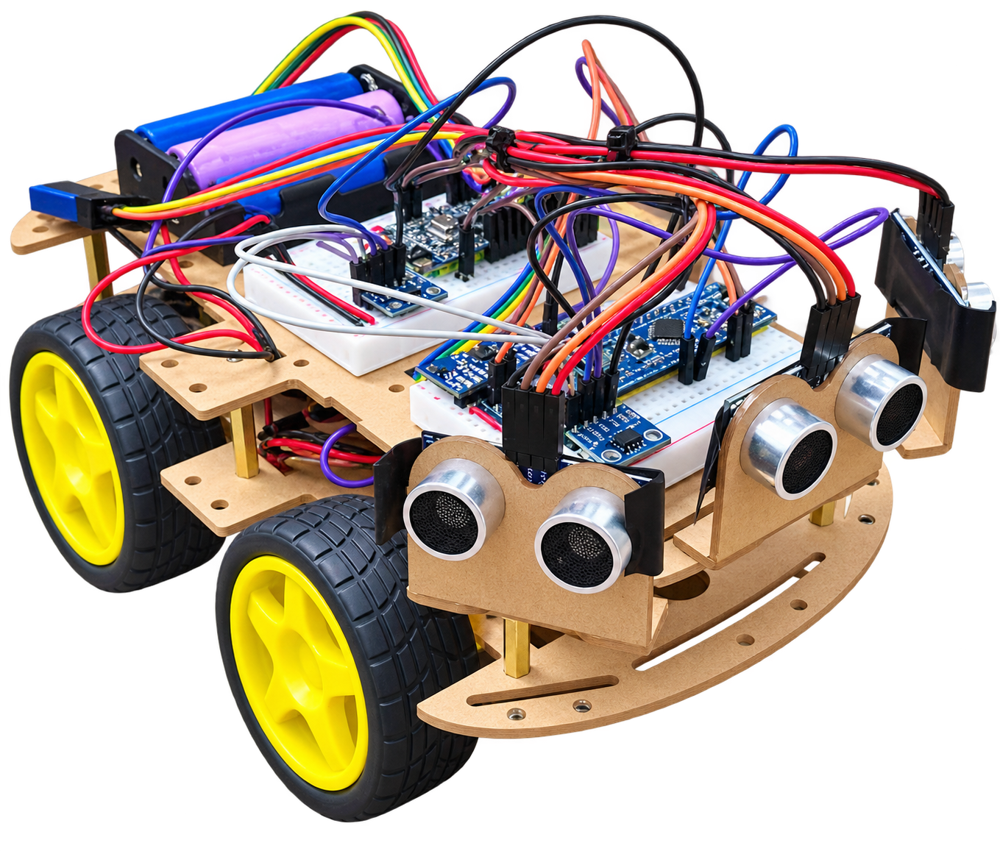
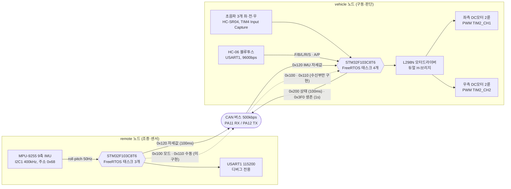
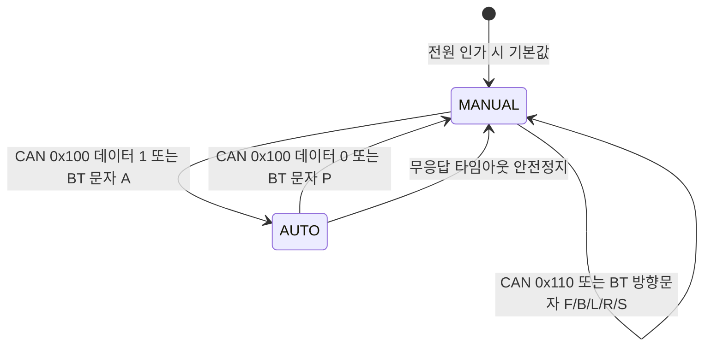
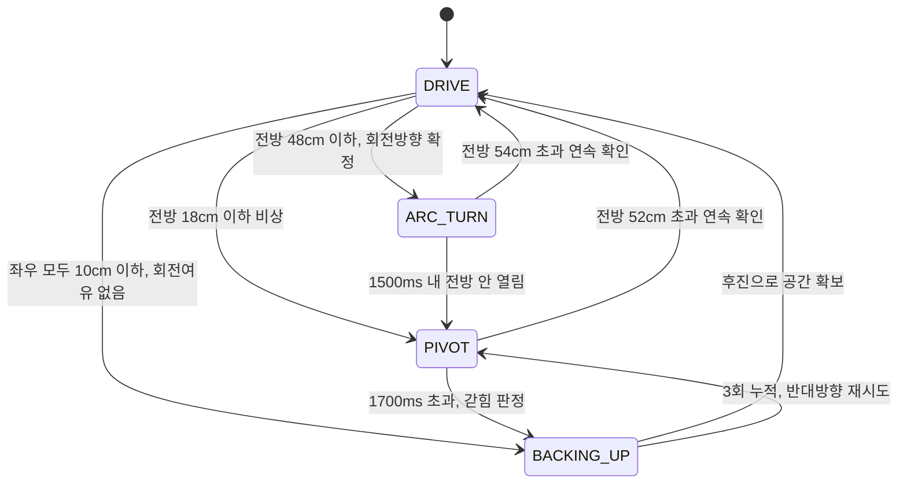

<div align="center">

# 🚗 STM32F103 자율주행 RC카 : CAN 기반 2-노드 분산 제어

### Ultrasonic Maze-Solving Vehicle + 9-Axis IMU Remote Node over CAN (Solo Project)

<br>


<br>


</div>
<br>

<!-- 시연 영상 추후 첨부 예정 -->
<p align="center">
  
</p>

<br>

초음파 센서 3개(좌·전·우)만으로 미로를 스스로 빠져나가는 **자율주행 RC카**를, **STM32F103 두 대를 CAN 버스로 묶은 2-노드 분산 시스템**으로 만든 프로젝트입니다. 두 노드 모두 차량에 함께 탑재됩니다.

**vehicle 노드(차량 노드)** 는 구동과 판단을 맡습니다. 4상태 논블로킹 FSM이 직선 주행·아크 선회·제자리 피벗·후진 회복을 상황에 따라 전환하며, **PD 제어 센터링**으로 통로 중앙을 유지하고 **회전 방향 투표(voting) 알고리즘**으로 초음파 난반사에 속아 U턴하는 오판을 막습니다. FreeRTOS 태스크 4개가 센서 트리거·주행 제어·CAN 송수신을 나눠 맡고, 블루투스(HC-06)로 휴대폰에서 직접 수동 조종하는 경로도 지원합니다.

**remote 노드(조종 노드)** 는 **MPU-9255 9축 IMU**(자이로 3축 + 가속도계 3축 + 지자기 3축)를 달고 있으며, 기울기로 차량을 조종합니다. I2C 버스 스캔·`WHO_AM_I` 칩 판별에 더해 가속도/자이로 기반 roll·pitch 상보필터를 50Hz로 실행하고, 계산한 자세값을 CAN `0x120`으로 100ms마다 vehicle에 전달합니다. CAN 루프백 자기진단·CAN_ESR 오류 감시·버스오프 소프트웨어 복구도 구현되어 있으며, 현재는 **실제 2-노드 물리 버스와 IMU 장착 방향을 검증하는 단계**입니다.

> 이 저장소는 **두 노드를 모두** 담고 있습니다 — `vehicle/`(차량 노드)와 `remote/`(조종 노드)는
> 서로 독립된 STM32CubeIDE 프로젝트이며, 500kbps CAN 버스 하나로 연결됩니다.
> 각 기능의 구현 여부는 [6-3. CAN ID 맵과 구현 상태](#6-3-can-id-맵과-구현-상태)에 정리해 두었습니다.

<br>

## 0. 목차

1. [시연](#1-시연)
2. [핵심 기술 요약](#2-핵심-기술-요약)
3. [프로젝트 개요](#3-프로젝트-개요)
4. [주요 기능](#4-주요-기능)
5. [자율주행 알고리즘 상세](#5-자율주행-알고리즘-상세)
6. [CAN 통신 상세](#6-can-통신-상세)
7. [시스템 구성](#7-시스템-구성)
8. [아키텍처](#8-아키텍처)
9. [핀맵](#9-핀맵)
10. [상태 전이](#10-상태-전이)
11. [실행 구조](#11-실행-구조)
12. [설계 포인트](#12-설계-포인트)
13. [Troubleshooting](#13-troubleshooting)
14. [빌드](#14-빌드)

<br>

## 1. 시연

<!-- 시연 GIF·영상은 추후 첨부 예정 -->

전원을 켜면 차량은 **수동 모드로 대기**합니다. 휴대폰 블루투스 앱에서 'A'를 보내면 자율주행이 시작되고, 차는 초음파 3개만으로 통로 중앙을 유지하며 미로를 통과합니다. 코너를 만나면 멈추지 않고 아크(호)를 그리며 돌고, 막다른 길에서는 제자리 피벗이나 후진으로 빠져나옵니다. 주행 중 언제든 'P'(블루투스) 또는 CAN 모드 명령으로 즉시 수동 조종으로 되돌릴 수 있습니다.

▶ **전체 시연 영상** : 추후 링크 첨부 예정 — 미로 자율주행, 코너 아크 선회, 막다른 길 후진 회복, 블루투스 수동 조종, CAN 원격 모드 전환

> 2-노드 CAN 연결은 현재 통신이 확립되지 않아 시연에 포함되지 않습니다. 원인 분리 과정은 [13-3](#13-3-can-통신-두절-원인-분리--루프백-자기진단)에 진행 상황을 기록해 두었습니다.

▶ **실측 성능 수치**(미로 통과 시간, 벽 충돌 횟수 등) : 추후 측정·정리 예정

<br>

## 2. 핵심 기술 요약

| 분류 | 핵심 기술 |
|---|---|
| **시스템 구성** | STM32F103 **2노드 분산 제어** — vehicle(구동·판단) / remote(조종·센서), 둘 다 차량 탑재 |
| **MCU** | STM32F103C8Tx (Blue Pill) x2, ARM Cortex-M3, STM32Cube HAL 기반 |
| **RTOS** | FreeRTOS (CMSIS-RTOS v1) — vehicle 태스크 4개(우선순위 분리, 뮤텍스·Mail Queue), remote 태스크 3개 |
| **자율주행 FSM** | 4-state 논블로킹 상태머신 (DRIVE / ARC_TURN / PIVOT / BACKING_UP) |
| **제어 이론** | PD 제어 센터링(좌우 거리차 기반), 전방거리 비례 속도 조절, 조향 변화율 제한(slew) |
| **센서 신호처리** | 지수이동평균(EMA) 필터 + 비대칭 상승 제한 — 난반사 스파이크 차단, 위험 방향은 즉시 반영 |
| **판단 알고리즘** | 회전 방향 투표(voting) — 접근 구간 전체를 적분해 순간 오판으로 인한 U턴 방지 |
| **통신 (CAN)** | 2-노드 공유 CAN 버스 500kbps, ID 대역 분리(0x100/0x200), Mail Queue 기반 ISR 브릿지 |
| **9축 IMU (remote)** | MPU-9255, I2C1 Fast Mode 400kHz, `WHO_AM_I`=0x73 확인, roll·pitch 상보필터 50Hz + CAN `0x120` 100ms 송신 구현 |
| **통신 진단** | CAN 루프백 자기진단(MCU 내부/외부 원인 분리), CAN_ESR 오류 카운터(TEC·REC·LEC) 감시, 버스오프 소프트웨어 자동 복구 |
| **통신 (BT)** | HC-06 블루투스 UART 9600bps, 인터럽트 수신 + 오버런(ORE) 자동 복구 |
| **모터 제어** | L298N 듀얼 H-브리지, TIM2 PWM 2채널(1kHz, duty 0~999)로 좌우 독립 속도 제어 |
| **거리 측정** | HC-SR04 3개, TIM4 Input Capture 3채널(1us 분해능)로 에코 펄스폭 직접 측정 |
| **안전 설계** | 명령 출처별 무응답 타임아웃(CAN 1s / BT 5s), 모드 전환 시 모터 정지 선행 |
| **구조** | AUTOSAR 스타일 4계층 아키텍처(ASW/RTE/BSW/Core), STM32CubeIDE 빌드 |

<br>

## 3. 프로젝트 개요

**인원** : 개인 프로젝트 | **MCU** : STM32F103C8Tx | **CubeMX** : 6.17.0 | **펌웨어 패키지** : STM32Cube FW_F1 V1.8.7

### 3-1. 프로젝트 일정

| 일정 | 단계 |
|---|---|
| 2026.06.15 | STM32CubeMX 프로젝트 생성 (핀 배치·주변장치 설정 확정) |
| 추후 정리 예정 | 4계층 아키텍처 구성 및 모터·초음파 드라이버 구현 |
| 추후 정리 예정 | 자율주행 FSM 및 PD 센터링 구현 |
| 추후 정리 예정 | CAN 2-노드 통신 및 FreeRTOS 태스크 분리 |
| 추후 정리 예정 | 주행 튜닝 (임계값·속도·게인 조정) |
| 2026.08.18 | 저장소를 2-노드 구조(`remote/` + `vehicle/`)로 개편, remote 노드 프로젝트 생성 |
| 2026.08.18 | remote 노드 진단 코드 — I2C 스캔·`WHO_AM_I` 칩 판별·CAN 수신 원형 버퍼, Live Expressions 관찰용 전역 변수 |
| 2026.08.19 | 양 노드 CAN 장애 진단 — 루프백 자기진단·CAN_ESR 감시·버스오프 소프트웨어 복구 |
| 진행 중 | CAN 물리 배선 문제 추적([13-3](#13-3-can-통신-두절-원인-분리--루프백-자기진단)), IMU 장착 방향·실차 기울기 조종 검증 |

> 초기 단계는 커밋 이력이 한 번에 정리되어 올라가 단계별 날짜를 확인할 수 없습니다. 확인 가능한 CubeMX 프로젝트 생성일과 커밋 이력이 남아 있는 2026.08 이후 작업만 사실로 기재하고, 나머지는 추후 정리 예정으로 남깁니다.

### 3-2. 담당 범위

개인 프로젝트로 하드웨어 배선부터 4계층 아키텍처 설계, 자율주행 FSM·PD 제어·투표 알고리즘 설계, CAN 통신 프로토콜 정의, FreeRTOS 태스크 분리, 실차 주행 튜닝까지 전 과정을 직접 진행했습니다. **두 노드(vehicle·remote) 모두 이 저장소 안에 있으며 양쪽 다 직접 작성**했습니다.

<br>

## 4. 주요 기능

**vehicle 노드(차량 노드)** 가 담당하는 기능입니다.

- **자율주행 (미로 통과)** : 초음파 3개 거리값만으로 4상태 FSM이 직선 주행·아크 선회·제자리 피벗·후진 회복을 판단해 전환합니다. 상세는 [5. 자율주행 알고리즘 상세](#5-자율주행-알고리즘-상세) 참고
- **통로 중앙 유지 (PD 센터링)** : 좌우 거리차를 오차로 삼아 좌우 바퀴 duty를 반대로 보정합니다. 비례항(P)이 중앙으로 되돌리고, 미분항(D)이 좌우로 흔들리는 위빙(weaving)을 감쇠시킵니다.
- **속도 자동 조절** : 전방이 열려 있으면 최고 속도, 코너가 가까워질수록 선형으로 감속해 코너 도착 전에 충분히 속도를 줄입니다.
- **블루투스 수동 조종** : HC-06으로 휴대폰 앱에서 'F'(전진)/'B'(후진)/'L'(좌회전)/'R'(우회전)/'S'(정지) 단일 문자를 받아 즉시 반영합니다.
- **모드 전환** : 'A'(자동) / 'P'(수동) 문자 또는 CAN 모드 명령(0x100)으로 전환합니다. **모드 문자는 현재 모드와 무관하게 항상 처리**되므로 자율주행 도중에도 즉시 수동으로 되돌릴 수 있습니다.
- **CAN 원격 제어 및 상태 보고** : vehicle 노드는 CAN으로 들어오는 모드 전환(`0x100`)·수동 조작(`0x110`) 명령을 처리할 준비가 되어 있고, 자신의 주행모드와 좌·전·우 거리값을 100ms 주기로 버스 전체에 브로드캐스트합니다(`0x200`). 다만 **이 명령들을 실제로 보내는 remote 쪽 송신 코드는 아직 없습니다.**
- **무응답 안전 정지** : 명령 출처별로 기준 시간을 나눠(CAN 1000ms / 블루투스 5000ms) 그 시간 안에 새 명령이 없으면 모터를 강제 정지시킵니다.

**remote 노드(조종 노드)** 의 현재 기능은 다음과 같습니다. 이 노드는 아직 **센서 인식과 통신 진단 단계**이며 주행에는 관여하지 않습니다.

- **I2C 장치 탐색 및 칩 판별** : 부팅 시 I2C 버스 전체(주소 1~127)를 훑어 응답한 주소를 모두 모으고, `0x68`이 응답하면 `WHO_AM_I`(0x75) 레지스터를 읽어 어떤 칩인지 판별합니다. 실제 보드에서 `0x73`을 읽어 **MPU-9255**로 확정했습니다(지자기 센서 AK8963은 주소 `0x0C`로 사용 가능).
- **CAN 수신 진단** : 모든 ID를 통과시키는 필터로 버스를 열어두고, 수신 인터럽트는 8칸 원형 버퍼에 담아두기만 하며 화면 출력은 `CanRxTask`가 대신 처리합니다.
- **CAN 루프백 자기진단** : 부팅 시 트랜시버와 버스 없이 자기가 보낸 프레임을 자기가 되받아, MCU 안쪽 설정(클럭·CAN 초기화·필터·내부 송수신 경로)이 정상인지 먼저 증명합니다. 상세는 [13-3](#13-3-can-통신-두절-원인-분리--루프백-자기진단) 참고
- **CAN 오류 감시 및 버스오프 복구** : CAN_ESR의 송신·수신 오류 카운터(TEC/REC), 마지막 오류 코드(LEC), 버스오프·오류수동·오류경고 플래그를 주기적으로 갱신하고, 버스오프에 빠지면 소프트웨어로 복구합니다.
- **현재 검증 중인 것** : roll·pitch 상보필터와 CAN `0x120` 송수신 코드는 구현되어 있습니다. 실물에서는 IMU 축 방향과 기울기 임계값을 검증해야 하며, yaw 산출을 위한 지자기 캘리브레이션은 아직 적용하지 않았습니다.

<br>

## 5. 자율주행 알고리즘 상세

이 프로젝트의 핵심입니다. 거리 센서 3개라는 최소한의 정보만으로 미로를 통과해야 하므로, **"센서를 얼마나 믿을 것인가"** 와 **"언제 무엇으로 판단할 것인가"** 를 나눠 설계했습니다.

### 5-1. 4-state FSM

모든 상태 전환은 `HAL_Delay` 없이 경과시간 비교만으로 이뤄지며, 50ms 제어 주기마다 한 번씩 평가됩니다.

| 상태 | 역할 | 핵심 동작 | 주요 파라미터 |
|---|---|---|---|
| **DRIVE** | 직선 주행 | PD 센터링으로 통로 중앙 유지 + 전방거리 비례 속도 조절 | 기본속도 560 / 감속 430 / 최소 220 |
| **ARC_TURN** | 무정지 아크(호) 선회 | 바깥바퀴 고속·안쪽바퀴 저속으로 **멈추지 않고** 코너 통과 — 일반 코너의 기본 처리 | 바깥 520 / 안쪽 320, 최소 200ms · 최대 1500ms |
| **PIVOT** | 제자리 피벗 회전 | 좌우 바퀴를 반대로 돌려 그 자리에서 회전 — 막다른 코너·급접근 등 **비상시에만** | duty 420, 최소 150ms · 최대 1700ms 초과 시 갇힘 판정 |
| **BACKING_UP** | 연속 후진 회복 | 최후 수단. 뒤로 물러나 다시 시도 | duty 450, 250ms 단위, 3회 누적 시 반대방향 피벗 재시도 |

**코너를 "멈춰서 도는" 대신 "달리면서 도는" 이유** — 제자리 피벗은 확실하지만 매 코너마다 정지→회전→재출발을 반복해 느리고, 정지마찰을 다시 이겨내야 해서 바퀴가 헛돌기 쉽습니다. 그래서 일반 코너는 아크 선회로 매끄럽게 통과하고, 아크로도 못 도는 상황(전방 18cm 이하)에서만 피벗으로 넘어가도록 2단계로 나눴습니다.

### 5-2. 거리 임계값

| 임계값 | 값 | 의미 |
|---|---|---|
| 비상 (EMERGENCY) | 18cm | 아크로도 못 도는 상황 → 제자리 피벗 전환 |
| 코너 진입 (TURN_ENTER) | 48cm | 코너 도착 판정 → 아크 선회 시작 |
| 감속 시작 (SPEED_FULL) | 85cm | 이 값 이상이면 최고 속도, 48~85cm 구간은 선형 보간 감속 |
| 경고 (WARNING) | 30cm | 후진 회복 완료 판정 등 일반 경고 거리 |
| 측면 막힘 (SIDE_BLOCK) | 10cm | 좌·우가 모두 이 값 이하면 회전 여유조차 없음 → 후진 |
| 아크 종료 (ARC_EXIT) | 54cm | 전방이 이 값을 넘으면 선회 종료 |
| 피벗 종료 (PIVOT_EXIT) | 52cm | 전방이 이 값을 넘으면 회전 종료 |

**히스테리시스 설계** — 아크 종료(54cm)와 피벗 종료(52cm)는 **반드시 코너 진입(48cm)보다 커야** 합니다. 만약 종료 기준이 진입 기준보다 작으면, 선회를 끝낸 직후 DRIVE 상태가 곧바로 다시 "코너 도착"으로 판정해 선회를 재진입하고, 결과적으로 제자리에서 돌기만 반복하게 됩니다. 진입보다 각각 +6cm, +4cm 위에 두어 이 왕복을 차단했습니다.

### 5-3. 센서 필터링 — 지수이동평균(EMA)과 비대칭 상승 제한

초음파 센서는 벽에 비스듬히 부딪히면 반사파가 되돌아오지 못해(난반사) **실제로는 벽이 있는데 "뻥 뚫려 있다"고 보고**하는 순간 오류를 냅니다. 이 한 번의 오류가 그대로 판단에 들어가면 벽으로 돌진하게 됩니다.

- **지수이동평균(EMA)** : 새로 측정한 값을 그대로 쓰지 않고 직전까지의 값과 섞어 씁니다. 전방은 새 값을 **1/2** 반영(반응성 우선), 좌우는 **1/3** 반영(안정성 우선)합니다.
- **상승 제한 12cm/사이클** : 필터값이 한 번에 늘어날 수 있는 폭을 12cm로 제한해, "갑자기 100cm 뚫렸다"는 스파이크가 판단에 섞이지 않게 합니다.
- **비대칭 적용** : 단, **가까워지는 방향(거리가 줄어드는 쪽)은 제한 없이 즉시 반영**합니다. 위험 신호를 늦게 받아들이면 안 되기 때문에, 필터는 "안전해졌다"는 정보만 천천히 믿고 "위험해졌다"는 정보는 곧바로 믿습니다.

### 5-4. 회전 방향 투표(voting) 알고리즘

**문제** — 코너에 닿는 순간의 좌우 한 쌍만 보고 방향을 정하면, 그 한 번이 하필 난반사였을 때 반대로 돌아 **왔던 길로 U턴해 출발지로 돌아가버립니다.** 미로 주행에서 가장 치명적인 실패였습니다.

**해결** — 코너에 닿는 순간이 아니라 **접근하는 구간 전체를 누적**해서 방향을 정합니다.

| 파라미터 | 값 | 역할 |
|---|---|---|
| 투표 구간 (VOTE_CM) | 65cm | 전방이 이 값 미만으로 좁아지면 매 사이클 (좌−우)를 적분 시작 |
| 사이클당 기여 상한 (VOTE_CLAMP) | 25cm | 한 사이클이 점수를 독점하지 못하게 제한 |
| 신뢰 기준 (VOTE_TH) | 30 | 누적 점수의 절댓값이 이 값 이상일 때만 투표 결과를 신뢰 |
| 적분 조건 (VOTE_OPEN_CM) | 45cm | 좌·우 중 **한쪽이 45cm 이상 열렸을 때만** 적분 |
| 즉단 기준 (GAP_DECISIVE_CM) | 30cm | 현재 좌우차가 이 이상이면 누적 점수보다 현재값을 우선 |
| 방향 잠금 (DIR_LOCK_MS) | 800ms | 직전 회전 종료 후 이 시간 안에 재회전이 필요하면 같은 방향 유지 |

각 파라미터가 막는 실패는 서로 다릅니다.

- **적분 조건 45cm** — 통로 안에서 양쪽 벽이 13cm 대 26cm처럼 조금 비대칭인 것은 "어디로 돌지"의 근거가 아닙니다. 한쪽이 45cm 넘게 열렸을 때, 즉 **"입구가 보인다"는 신호일 때만** 점수에 반영합니다.
- **즉단 기준 30cm** — 좌우차가 30cm 이상 벌어졌다면 한쪽이 통로 입구처럼 확실히 열린 상황입니다. 상승 제한 필터를 이미 통과한 값이라 순간 난반사만으로는 이만큼 벌어질 수 없으므로, 이때는 누적 점수를 기다리지 않고 현재값을 따릅니다.
- **방향 잠금 800ms** — S자 미로의 연속된 코너 두 개는 항상 **같은 방향 회전 쌍**입니다. 두 번째 코너에서 방향을 새로 투표하다 뒤집히면 그대로 U턴이 되므로, 직전 회전 직후에는 재투표 없이 방향을 유지합니다.
- **방향 미확정 상태로 코너 도달 시** — 저속(duty 400)으로 기어가며(creep) 개방 신호를 기다리고, 전방이 26cm 이하로 좁아지면 더 기다리지 않고 그 시점의 최선의 정보로 회전 방향을 강제 확정합니다.

### 5-5. 튜닝 이력

초음파 트리거는 좌→전→우 순으로 한 번에 하나씩만 쏩니다(서로의 반사파를 잘못 받는 혼선을 막기 위함). 그래서 **전방 센서는 최악의 경우 약 195ms에 한 번만 갱신**되고, 그 사이 차는 계속 전진합니다. 이 갱신 지연 동안 전진하는 거리를 보상하기 위해, **임계값은 앞당기고 속도는 낮추는** 방향으로 일괄 재조정했습니다.

| 항목 | 변경 전 | 변경 후 | 이유 |
|---|---|---|---|
| 비상 거리 | 12cm | **18cm** | 센서 갱신 지연(195ms) 동안 전진하는 거리만큼 반응 시간 확보 |
| 코너 진입 | 36cm | **48cm** | "벽에 닿은 뒤 회전"하는 현상 제거 |
| 감속 시작 | 60cm | **85cm** | 코너 진입 상향에 비례해 감속 시작 지점도 앞당김 |
| 기본 주행속도 | 660 | **560** (약 15% 감속) | 전진 거리 자체를 줄여 정지거리 단축 |
| 아크 바깥바퀴 | 620 | **520** (약 15% 감속) | 선회 궤적을 줄여 반응 여유 확보 |
| 센터링 KP | 3 | **5** | 통로 한쪽 벽에 붙어 긁히는 현상 → 복원력 강화 |
| 센터링 KD | 20 | **28** | KP 상향에 맞춰 감쇠도 상향 — 위빙 없이 센터링만 빨라지게 |
| 보정 상한 | 110 | **140** | 게인만 올리고 상한을 두면 곧바로 클리핑돼 강화 효과가 사라짐 |
| 아크 종료 | 42cm | **54cm** | 코너 진입(48cm)보다 반드시 커야 재진입 반복이 없음 |
| 피벗 종료 | 40cm | **52cm** | 위와 같은 이유 |

> **KP만 올려선 안 되는 이유** — 게인(KP)을 올리면 보정량이 커지지만 상한(MAX_CORR)에 걸려 잘려나가면 실제 출력은 그대로입니다. 그리고 P만 올리면 중앙을 지나쳐 반대편으로 넘어가는 위빙이 심해지므로, 이를 억제하는 D(KD)도 함께 올려야 합니다. 세 값을 한 세트로 조정한 이유입니다.

<br>

## 6. CAN 통신 상세

### 6-1. 2-노드 구성

하나의 CAN 버스를 두 노드가 공유하며, **ID 대역으로 발신자를 구분**합니다. CAN은 주소가 아니라 메시지 ID로 통신하는 방식이라, 대역을 나눠두면 수신 측이 ID만 보고 누가 보낸 것인지 즉시 알 수 있습니다. 두 노드는 모두 차량에 함께 탑재됩니다.

```
[remote 노드]  조종·센서              [vehicle 노드]  구동·판단
 STM32F103C8T6 (Blue Pill)             STM32F103C8T6 (Blue Pill)
 MPU-9255 9축 IMU                      L298N 모터 + 초음파 3개 + HC-06
        │                                       │
        └────────── CAN 500kbps ────────────────┘
```

| 노드 | 폴더 / 프로젝트명 | 역할 | ID 대역 |
|---|---|---|---|
| **remote** (조종 노드) | `remote/` · `Project03_Remote` | MPU-9255 9축 IMU 자세 측정 → `0x120`으로 roll/pitch 브로드캐스트 (**구현 완료**). 모드·조향 문자 명령(`0x100`/`0x110`) 송신은 **의도적으로 범위 밖** — 아래 참고 | 0x100 ~ 0x1FF |
| **vehicle** (차량 노드) | `vehicle/` · `Project03_Vehicle` | 자율주행·수동주행·모터 구동, 상태·거리값·하트비트 브로드캐스트, remote의 IMU 기울기를 좌우 차등 PWM으로 변환해 세 번째 수동조종 경로로 사용 | 0x200 ~ 0x2FF, 0x3F0 |

> 기존에는 이 자리에 **NUCLEO 마스터 노드(Node1)** 를 두는 구성이었고, vehicle 노드의 `0x100`/`0x110` 수신 처리 코드도 그 전제로 작성되어 지금까지 남아 있습니다. 지금은 그 자리를 **remote 노드**가 대신하지만, `0x100`/`0x110`을 remote가 실제로 보내는 코드는 **이번에도 일부러 만들지 않았습니다** — remote 보드에는 모드를 전환할 버튼이 물리적으로 없어서, 임의로 "이만큼 기울이면 자동/수동 전환"처럼 트리거를 지어내는 대신 모드 전환은 계속 BT 앱이 맡도록 남겨 뒀습니다. 대신 remote는 `0x120`(IMU_ATTITUDE)만 주기 송신하고, vehicle이 그 각도를 받아 세 번째 조종 경로로 씁니다.

### 6-2. 통신 규격

양 노드가 동일한 설정을 씁니다. 두 노드 모두 HSE 8MHz를 PLL로 9배 곱해 SYSCLK 72MHz, APB1(PCLK1) 36MHz로 동작하므로 비트 타이밍 값도 같습니다.

| 항목 | 값 |
|---|---|
| 물리 계층 | CAN 트랜시버 경유 2선식 공유 버스 |
| 핀 | PA11 (CAN_RX) / PA12 (CAN_TX) — 양 노드 동일 |
| 통신 속도 | **500kbps** (PCLK1 36MHz ÷ 프리스케일러 4 ÷ 18TQ) |
| 비트 타이밍 | SJW 1TQ, BS1 15TQ, BS2 2TQ |
| 동작 모드 | Normal (remote는 부팅 직후 자기진단을 위해 잠시 Loopback으로 전환했다가 Normal로 복귀) |
| 수신 처리 | vehicle : RX FIFO0 인터럽트 → Mail Queue → CanRxTask<br>remote : RX FIFO0 인터럽트 → 8칸 원형 버퍼 → CanRxTask |
| 수신 필터 | vehicle : FilterBank 0 하나로 `0x100`~`0x1FF` 대역만 통과(마스크 0x700, ID 상위 3비트 일치 검사)<br>remote : 마스크 0(모든 ID 통과) — 버스에 흐르는 ID를 전부 확인하기 위한 진단용 설정 |

### 6-3. CAN ID 맵과 구현 상태

송신부와 수신부의 구현 상태를 나눠 적었습니다. **한쪽만 구현된 ID는 아직 실제로 오가지 않습니다.**

| CAN ID | 이름 | 방향 | 송신부 | 수신부 | 내용 |
|---|---|---|---|---|---|
| **0x100** | MODE_CMD | remote → vehicle | **미구현 (의도적)** | 구현 | `data[0]`이 1이면 AUTO, 그 외는 MANUAL. **전환 시 항상 모터 정지를 먼저 수행**. remote에 물리 버튼이 없어 송신부는 만들지 않음 — 아래 참고 |
| **0x110** | MANUAL_CMD | remote → vehicle | **미구현 (의도적)** | 구현 | `data[0]`에 'F'/'B'/'L'/'R'/'S' 방향 문자. remote는 문자 명령 대신 `0x120`(각도)로 조종하므로 이 경로는 당분간 안 씀 |
| **0x120** | IMU_ATTITUDE | remote → vehicle | **구현** | **구현** | MPU-9255 roll/pitch(0.1도 단위). 100ms 주기 브로드캐스트, vehicle이 좌우 차동 PWM으로 변환 |
| **0x200** | VEHICLE_STATUS | vehicle → 전체 | 구현 | — | 100ms 주기, 주행모드 + 좌·전·우 거리값 |
| **0x3F0** | HEARTBEAT | vehicle → 전체 | **구현** | — | 1초 주기, 1바이트 상태 비트필드 — 아래 참고 |

코드에서 송수신하도록 구현된 것은 **`0x120`(remote→vehicle)과 `0x200`·`0x3F0`(vehicle→전체) 세 가지**입니다. 실제 물리 버스 통신은 현재 검증 중입니다. `0x100`/`0x110`은 여전히 수신 처리 코드만 있고, 이를 보내는 remote 쪽 코드는 **이번 단계에서 일부러 만들지 않았습니다** — remote 보드에는 모드 전환을 트리거할 버튼이 없어 이 부분은 BT 앱(vehicle의 시리얼 경로)이 맡도록 남겼습니다. 대신 remote가 만드는 기울기 신호는 `0x120` 하나에 실어 보내고, vehicle은 이를 **세 번째 수동조종 명령 출처(IMU)** 로 받아 CAN 출처와 동일한 1000ms 무응답 기준으로 감시합니다 — 자세한 변환 규칙은 6-4를 참고하세요.

> **코드상의 이름을 정리했습니다** — `mcal_can.h`의 매크로를 NUCLEO 마스터 구성 시절의 이름(`MCAL_CAN_ID_MASTER_MODE_CMD` 등)에서 현재 아키텍처를 그대로 반영한 이름(`MCAL_CAN_ID_REMOTE_MODE_CMD`, `MCAL_CAN_ID_REMOTE_MANUAL_CMD`, `MCAL_CAN_ID_VEHICLE_STATUS`, `MCAL_CAN_ID_VEHICLE_HEARTBEAT`)으로 바꾸고, 모든 호출부(스위치문·송신 코드)를 같이 갱신했습니다. ID 값은 그대로입니다. (단, `McalCanSlaveState_t`처럼 ID가 아닌 다른 곳에 남은 "slave" 표현은 이번 범위 밖이라 아직 남아 있습니다.)

### 6-4. 메시지 포맷

**0x200 VEHICLE_STATUS** (DLC 8, 100ms 주기 브로드캐스트)

| 바이트 | 내용 | 비고 |
|---|---|---|
| data[0] | 주행 상태 코드 | 0 = MANUAL / 1 = AUTO / 2 = FAULT |
| data[1] | 좌측 거리 (cm) | 255cm 초과 시 255로 포화 |
| data[2] | 전방 거리 (cm) | 255cm 초과 시 255로 포화 |
| data[3] | 우측 거리 (cm) | 255cm 초과 시 255로 포화 |
| data[4] | 롤링 카운터 | 송신할 때마다 1씩 증가 — 수신 측이 프레임 유실을 감지하는 용도 |
| data[5] | Fault 플래그 | 현재 0 고정, 추후 확장용 |
| data[6~7] | 예약 | 0 |

거리값을 1바이트로 담기 때문에 255cm에서 포화됩니다. 자율주행 판단 임계값이 최대 85cm이므로 제어에는 영향이 없고, 이 필드는 원격 모니터링 용도입니다.

**0x3F0 HEARTBEAT** (DLC 1, 1초 주기 브로드캐스트) — data[0]은 단일 플래그가 아니라 **상태 비트필드**입니다.

| 비트 | 의미 |
|---|---|
| bit0 | CAN 버스오프 복구가 지금 실패 상태(`g_vdiag_can_stuck`) — 성공하면 자동으로 0으로 돌아가는 레벨 플래그, 영구 래치 아님 |
| bit1 | CAN 에러패시브(EPVF) 상태 |
| bit2 | CAN 에러경고(EWGF) 상태 |
| bit3 | CAN RX 인터럽트(notification)가 비활성 상태 |
| bit4 | 50ms 제어 루프(CtrlTask)가 정지된 것으로 추정됨 — 하트비트 주기마다 루프 카운터가 증가했는지로 판정. **이 비트가 실제로 존재하는 이유**: 처음 버전은 CanTxTask(최저 우선순위)가 아직 돌고 있다는 것만 증명해서, 정작 CtrlTask가 멈춰 모터가 마지막 명령으로 계속 도는 상황에서도 "정상"으로 보고되는 문제가 있었습니다 |
| bit5~7 | 예약, 0 |

**0x100 / 0x110 명령** — 두 메시지 모두 `data[0]` 1바이트만 사용합니다. 모드 명령은 1/0, 수동 명령은 방향 문자 1개로, 블루투스 명령과 동일한 표현을 써서 **두 경로가 같은 처리 함수로 합류**하도록 했습니다.

**0x120 IMU_ATTITUDE** (DLC 8, 100ms 주기 브로드캐스트) — **구현 완료.** 모든 다바이트 필드는 **MSB 먼저(빅엔디안)**.

| 바이트 | 내용 | 형식 |
|---|---|---|
| data[0~1] | roll (좌우 기울기) | int16, **0.1도 단위** (예: -23.4도 → -234) |
| data[2~3] | pitch (앞뒤 기울기) | int16, 0.1도 단위 |
| data[4~5] | yaw (방위) | **항상 0x0000 — 이번 단계에서는 미사용** (자기 캘리브레이션이 손이 많이 가는 AK8963 나침반을 이번 범위에서 뺐습니다) |
| data[6] | 상태 플래그 | bit0 = remote 자이로 영점(bias) 보정 완료 여부. vehicle은 이 비트로 제어를 막지 않고, 프레임이 왔다는 사실 자체를 유효한 명령으로 취급합니다 |
| data[7] | 롤링 카운터 | 송신할 때마다 1씩 증가 — 프레임 유실 감지 |

**remote 쪽 구현** — MPU-9255(가속도+자이로 6축, I2C1 @0x68)를 직접 레지스터 단위로 읽어(`remote/Core/Src/mpu9255.c`), 상보필터(complementary filter, α=0.98)로 가속도 기반 각도(짧은 노이즈엔 약하지만 장기적으로 안 흘러감)와 자이로 적분 각도(짧게는 정확하지만 오래 두면 흘러감)를 섞습니다. 부팅 직후 자이로를 약 1초간 정지 상태로 가정하고 200회 샘플링해 영점(bias)을 구해 이후 모든 자이로 값에서 빼는 보정을 거칩니다. `ImuTask`가 20ms(50Hz)마다 갱신하고 5번에 1번(100ms)만 CAN으로 내보냅니다. 센서 장착 방향(보드 수평, X축=전방)을 기준으로 계산식을 세웠지만 실물로 검증한 적은 없어서, `IMU_ROLL_INVERT`/`IMU_PITCH_INVERT`(`remote/Core/Inc/mpu9255.h`) 두 스위치를 0→1로 바꾸는 것만으로 좌우/앞뒤가 실제로 반대로 나올 경우 수식을 안 건드리고 바로잡을 수 있게 해뒀습니다.

**vehicle 쪽 구현** — `0x120`을 받으면(`ASW_Manual_ApplyCanCommand` in `asw_manual_control.c`) 기존 CAN(0x110)·SERIAL(BT 문자)에 이어 **세 번째 명령 출처(`ASW_MANUAL_CMD_SOURCE_IMU`)** 로 취급합니다. 무응답 기준은 같은 remote가 보내는 CAN 출처이므로 CAN과 동일한 1000ms를 그대로 씁니다. 각도 → 좌우 duty 변환 규칙(`ComputeTiltDuty`):

| 조건 | 동작 |
|---|---|
| roll·pitch 모두 ±5도 미만 | 데드존 — 정지 (리모컨을 평평하게 든 상태) |
| pitch 크기 | ±30도에서 최대 duty(999)에 도달하도록 선형 매핑, 데드존을 막 벗어난 지점은 최소 duty(300)에서 시작(그 밑으로는 모터가 안 돔) |
| pitch 부호 | 양수(앞으로 기울임) = 전진, 음수 = 후진 |
| roll 크기·부호 | 위에서 구한 기본 duty에 좌/우 반대 부호로 절반 범위만큼 가감 — 조향 편차만 주고 그 자체로 포화되지 않게 함 |

전진은 기존 `RTE_Motor_DriveForwardDifferential(left, right)`로, 후진은 이번에 새로 만든 `RTE_Motor_DriveBackwardDifferential(left, right)`로 처리합니다 — `ECU_L298N_DriveForwardDifferential`을 그대로 본떠 방향 핀만 후진 헬퍼로 바꾼 대응 함수를 BSW/RTE에 추가했습니다. (처음에는 `RTE_Motor_DriveBackward(0)`으로 방향 핀만 세팅한 뒤 `RTE_Motor_SetSpeed`를 얹는 임시방편으로 구현했었는데, "`SetSpeed`가 방향 핀을 안 건드린다"는 문서화되지 않은 사실에 기대는 방식이라 정리 과정에서 정식 API로 교체했습니다.)

**방향 문자가 아니라 각도 원본을 보내기로 한 이유** — 기울기를 `'L'`/`'R'` 같은 방향 문자로 바꿔서 보내면, 보내는 쪽에서 이미 "왼쪽"이라는 결론까지 내버린 것이라 **얼마나 기울었는지가 사라집니다.** 각도를 그대로 보내면 두 가지가 가능해집니다.

- **수동주행** : 기울기 크기에 비례한 조향 — 살짝 기울이면 완만하게, 많이 기울이면 급하게 돌 수 있습니다. 지금의 수동주행은 방향 문자만 받으므로 조향 세기가 한 단계뿐입니다.
- **자율주행** : 회전 각도를 시간이 아니라 **실제 각도로 판정**할 수 있습니다. 현재 vehicle의 `ASW_AUTO_PIVOT_EXPECT_MS`(500ms)는 "90도 도는 데 500ms쯤 걸릴 것"이라는 시간 기반 추정값이고, 코드 주석에도 *"경험적 추정, 실측 보정 필요"* 로 남아 있습니다. 자이로 각도를 받으면 이 추정을 실제 회전각 기준으로 대체할 수 있습니다.

0.1도 단위 int16을 쓰면 ±3276.7도까지 표현되어 각도 범위에 여유가 충분하고, 소수점 있는 실수(float)를 주고받지 않아도 되어 수신 측 처리가 단순해집니다.

**ID를 0x120으로 정한 이유** — vehicle의 수신 필터는 `0x100`~`0x1FF` 대역을 통과시키므로, 이 대역 안에서 고르면 **필터 설정을 건드리지 않고도 그대로 수신**됩니다. `0x100`(모드)·`0x110`(수동)과 같은 remote 발신 대역에 두어 발신자 구분 규칙도 유지됩니다.

> 상태 코드 enum에는 `MCAL_CAN_STATE_FAULT`(2)가 정의돼 있지만 **현재 이 값을 설정하는 코드 경로는 없습니다.** 자체 진단으로 고장을 판정하는 로직이 아직 없기 때문이며, 실제로 브로드캐스트되는 값은 0 또는 1뿐입니다.
>
> `mcal_can.h`의 `MCAL_CAN_TIMEOUT_MASTER_MS`(1000ms)도 정의만 되어 있고, 실제 무응답 판정은 ASW 계층(`asw_manual_control`)의 자체 타임아웃이 담당합니다.

### 6-5. Mail Queue를 선택한 이유

CAN 수신 인터럽트가 받은 메시지를 태스크로 넘기는 다리 역할을, 일반적인 메시지 큐가 아니라 **Mail Queue**로 구현했습니다.

- **문제** : CMSIS-RTOS v1의 `osMessageQ`는 **32비트 값 하나(포인터 또는 정수)만** 전달할 수 있습니다. 그런데 넘겨야 할 CAN 메시지는 `{ id, dlc, data[8] }` 구조체 전체입니다.
- **포인터를 넘기면?** : ISR의 지역 변수 주소를 넘기면 ISR이 끝나는 순간 그 메모리는 무효가 되고, 별도 버퍼를 직접 관리하자니 ISR 안에서 안전한 메모리 할당이 필요합니다.
- **해결** : `osMailQ`는 **ISR에서 안전하게 쓸 수 있는 할당(alloc)과 넣기(put)** 를 제공하고, 구조체 전체를 값으로 복사해 전달합니다. ISR은 할당→복사→put만 하고 즉시 빠져나오며, 실제 처리는 `CanRxTask`가 담당합니다.

```
[CAN 수신 인터럽트]                    [CanRxTask]
 HAL_CAN_RxFifo0MsgPendingCallback      osMailGet (블로킹 대기)
   ├─ HAL_CAN_GetRxMessage (Read)              │
   ├─ osMailAlloc  (ISR-safe)                  │
   ├─ 구조체 복사                               ▼
   └─ osMailPut   ──────────────────►  ASW_Manual_ApplyCanCommand
        (여기까지가 ISR, 최소한만)            (ID별 라우팅·실제 처리)
```

**ISR 최소화 원칙** — 인터럽트 안에서 오래 머무르면 다른 인터럽트(특히 초음파 에코 캡처)를 놓칩니다. 그래서 ISR은 읽기와 큐 삽입만 하고, 모드 전환·모터 제어 같은 실제 처리는 전부 태스크로 넘겼습니다.

<br>

## 7. 시스템 구성

실선은 송수신 코드까지 구현된 경로, 점선은 **수신부 또는 정의만 있는 경로**입니다. 실제 2-노드 CAN 물리 통신은 검증 중입니다.



<br>

## 8. 아키텍처

AUTOSAR(차량용 소프트웨어 표준 구조)의 계층 개념을 참고해 **4계층**으로 나눴습니다. 핵심은 **"무엇을 할지 정하는 층(ASW)"과 "어떻게 할지 아는 층(BSW)"이 서로를 직접 부르지 않고, 중간의 RTE를 통해서만 대화한다**는 것입니다. 덕분에 ASW는 모터가 L298N인지, 센서가 HC-SR04인지 몰라도 됩니다.

```
┌──────────────────────────────────────────────────────┐
│                                                      │
│   ASW/    응용 소프트웨어 (주행 정책 · 판단)          │
│           asw_autonomous      자율주행 4-state FSM   │
│           asw_manual_control  수동주행 · 모드 전환    │
│                                                      │
├──────────────────────────────────────────────────────┤
│                                                      │
│   RTE/    런타임 환경 (계층 간 인터페이스)            │
│           rte_motor           주행 명령 추상화        │
│           rte_sensor          거리값 제공             │
│           rte_mode_manager    주행모드 중재 (Mutex)   │
│                                                      │
├──────────────────────────────────────────────────────┤
│                                                      │
│   BSW/    기반 소프트웨어                             │
│    ├ ECU_Abs/  부품 드라이버                          │
│    │    ecu_l298n     모터드라이버 제어               │
│    │    ecu_hcsr04    초음파 거리 측정                │
│    └ MCAL/     마이크로컨트롤러 추상화                 │
│         mcal_can       CAN 송수신 + Mail Queue 브릿지 │
│         mcal_bt_serial 블루투스 UART 인터럽트 수신    │
│                                                      │
├──────────────────────────────────────────────────────┤
│                                                      │
│   Core/   CubeMX HAL 초기화 + FreeRTOS                │
│           gpio · tim · usart · can · freertos · main  │
│                                                      │
└──────────────────────────────────────────────────────┘
```

**계층 분리의 실제 효과** — 예를 들어 `asw_autonomous`는 "왼쪽으로 아크 선회하라"는 의도만 `rte_motor`에 전달하고, 그것이 좌우 바퀴의 어떤 PWM duty와 어떤 방향 핀 조합으로 바뀌는지는 `ecu_l298n`이 혼자 압니다. 모터드라이버를 다른 부품으로 바꿔도 ASW 코드는 그대로입니다.

**명명 규칙** — 계층별로 함수 이름 앞머리를 고정해, 함수 이름만 봐도 어느 계층 코드인지 즉시 구분됩니다.

| 계층 | 규칙 | 예시 |
|---|---|---|
| ASW | `ASW_<Module>_<Verb><Object>()` | `ASW_Autonomous_ProcessControl()` |
| RTE | `RTE_<Module>_<Verb><Object>()` | `RTE_Sensor_GetDistance()` |
| BSW / ECU_Abs | `ECU_<Module>_<Verb><Object>()` | `ECU_HCSR04_...` |
| BSW / MCAL | `MCAL_<Module>_<Verb><Object>()` | `MCAL_CAN_Transmit()` |

저장소는 CAN 버스로 연결된 두 노드를 각각의 폴더로 나눠 담습니다. 두 폴더는 서로 독립된 STM32CubeIDE 프로젝트이며, 공용 문서만 최상위에 둡니다.

```
Project03_SelfDrivingCar/
├── README.md                     # 시스템 전체 문서 (CAN 프로토콜·노드 구성)
├── remote/                       # 조종 노드 — MPU-9255 9축 IMU, 진단 단계
│   ├── Core/                     #   CubeMX 생성 HAL 초기화 + 진단 코드 전체
│   │   ├── main.c                #     I2C·CAN 초기화, 수신 원형 버퍼, 진단 전역 변수
│   │   └── freertos.c            #     I2C 스캔·칩 판별, CAN 루프백 자기진단, ESR 감시
│   ├── Drivers/ Middlewares/     #   CMSIS + HAL + FreeRTOS
│   └── Project03_Remote.ioc
└── vehicle/                      # 차량 노드 — 자율주행·수동주행·모터 구동
    ├── ASW/                      # 응용 소프트웨어 (주행 정책·판단)
    │   ├── Inc, Src
    │   │   ├── asw_autonomous        # 자율주행 4-state FSM, PD 센터링, 방향 투표
    │   │   └── asw_manual_control    # 수동주행, CAN/BT 명령 처리, 모드 전환, 타임아웃
    ├── RTE/                      # 런타임 환경 (계층 간 인터페이스)
    │   ├── Inc, Src
    │   │   ├── rte_motor             # 주행 명령 추상화 (전진/후진/선회/정지)
    │   │   ├── rte_sensor            # 초음파 트리거·거리값 제공
    │   │   └── rte_mode_manager      # 주행모드 전역 상태 (Mutex 보호)
    ├── BSW/                      # 기반 소프트웨어
    │   ├── ECU_Abs/Inc, Src
    │   │   ├── ecu_l298n             # L298N 모터드라이버 (PWM duty + 방향 핀)
    │   │   └── ecu_hcsr04            # HC-SR04 초음파 (Input Capture 펄스폭 → cm)
    │   └── MCAL/Inc, Src
    │       ├── mcal_can              # CAN 송수신, Mail Queue 브릿지, ISR 핸들러
    │       └── mcal_bt_serial        # HC-06 UART 인터럽트 수신, 오버런 복구
    ├── Core/
    │   ├── Inc, Src                  # CubeMX 생성 HAL 초기화, freertos.c, main.c
    │   └── Startup                   # 스타트업 어셈블리
    ├── Drivers/                      # CMSIS + STM32F1xx HAL (표준 라이브러리)
    ├── Middlewares/                  # FreeRTOS (CMSIS-RTOS v1)
    ├── Project03_Vehicle.ioc         # CubeMX 설정 파일
    └── STM32F103C8TX_FLASH.ld        # 링커 스크립트
```

위 4계층 구조(ASW/RTE/BSW/Core) 설명은 `vehicle/` 노드에 해당합니다. `remote/` 노드는 CAN 진단과 IMU 자세 추정·송신 코드가 CubeMX 기본 구조(`Core/`) 안에 들어 있습니다. 실제 하드웨어 검증이 끝난 뒤 같은 계층 규칙(`ECU_MPU9255_...`, `MCAL_CAN_...` 등)으로 분리할 예정입니다.

진단 코드를 계층으로 나누지 않고 `Core/`에 둔 이유는, 이 단계의 목적이 **"부품이 살아 있는가, 통신 설정이 맞는가"를 확인하는 것**이라 추상화 계층을 거치면 오히려 원인이 어디인지 흐려지기 때문입니다. 하드웨어를 직접 두드려 보는 코드는 HAL 바로 위에 두는 편이 진단에 유리합니다.

<br>

## 9. 핀맵

### 9-1. vehicle 노드 (차량 노드)

| 기능 | 핀 | 비고 |
|---|---|---|
| MOTOR_ENA_L | PA0 | TIM2_CH1 PWM — 좌측 모터 속도 |
| MOTOR_ENB_R | PA1 | TIM2_CH2 PWM — 우측 모터 속도 |
| MOTOR_IN1 / IN2 | PA2 / PA3 | GPIO 출력, 좌측 모터 방향 |
| MOTOR_IN3 / IN4 | PA4 / PA5 | GPIO 출력, 우측 모터 방향 |
| TRIG_LEFT / FRONT / RIGHT | PB0 / PB1 / PB10 | GPIO 출력, 초음파 트리거 |
| ECHO_LEFT / FRONT / RIGHT | PB6 / PB7 / PB8 | TIM4_CH1 / CH2 / CH3 Input Capture |
| USART1 TX / RX | PA9 / PA10 | HC-06 블루투스, 9600bps |
| CAN_RX / CAN_TX | PA11 / PA12 | 2-노드 CAN 버스, 500kbps |
| SWDIO / SWCLK | PA13 / PA14 | 디버그 (Serial Wire) |
| OSC_IN / OSC_OUT | PD0 / PD1 | 외부 크리스탈 |

**타이머 설정**

| 타이머 | 프리스케일러 | 주기(Period) | 용도 |
|---|---|---|---|
| TIM2 | 71 | 999 | 모터 PWM 1kHz, duty 범위 0~999 (예: duty 560 ≈ 56%) |
| TIM4 | 71 | 65535 | 초음파 Input Capture, 1카운트 = 1us 분해능 |

두 타이머 모두 프리스케일러 71을 써서 72MHz 클럭을 1MHz(1us)로 나눕니다. TIM4는 이 1us 눈금으로 에코 펄스의 폭을 직접 재고, 그 시간을 거리(cm)로 환산합니다.

### 9-2. remote 노드 (조종 노드)

| 기능 | 핀 | 비고 |
|---|---|---|
| I2C1 SCL / SDA | PB6 / PB7 | MPU-9255 9축 IMU, Fast Mode 400kHz, 주소 0x68 |
| CAN_RX / CAN_TX | PA11 / PA12 | 2-노드 CAN 버스, 500kbps |
| USART1 TX / RX | PA9 / PA10 | **디버그 전용**, 115200bps |
| SWDIO / SWCLK | PA13 / PA14 | 디버그 (Serial Wire) |
| OSC_IN / OSC_OUT | PD0 / PD1 | 외부 크리스탈 8MHz |

**vehicle과 같은 핀 번호가 다른 용도로 쓰입니다** — PB6/PB7은 vehicle에서 초음파 에코 입력(TIM4 캡처)이지만 remote에서는 I2C1입니다. 서로 다른 보드이므로 충돌하지 않습니다. USART1도 vehicle에서는 HC-06 블루투스가 점유해 디버그로 쓸 수 없는 반면, **remote는 블루투스가 없어 UART를 온전히 디버그 용도로 쓸 수 있습니다.**

**MPU-9255 모듈 배선**

| 모듈 핀 | 연결 | 이유 |
|---|---|---|
| VCC | 3.3V | — |
| GND | GND | — |
| SCL / SDA | PB6 / PB7 | I2C1 |
| AD0 | GND | I2C 주소를 0x68로 확정 (3.3V에 물리면 0x69가 됨) |
| NCS | **3.3V** | MPU-9250 계열은 I2C/SPI 겸용이라, NCS를 HIGH로 올려두어야 I2C 모드로 동작 |
| FSYNC | GND | 외부 동기 신호를 쓰지 않으므로 접지 |
| EDA / ECL / INT | 미연결 | 보조 I2C·인터럽트 미사용 |

**클럭 구성** — HSE 8MHz 외부 크리스탈을 PLL로 9배 곱해 SYSCLK 72MHz, APB1(PCLK1) 36MHz입니다. CAN은 APB1에 물려 있으므로 이 36MHz가 500kbps 비트 타이밍 계산의 기준이 됩니다(vehicle 노드와 동일).

<br>

## 10. 상태 전이

### 10-1. 주행 모드 전환 (수동 ↔ 자동)



모드 전환 시에는 **항상 모터 정지를 먼저 수행**한 뒤 새 모드로 넘어갑니다. 이전 모드의 마지막 명령이 새 모드에 잔류해 의도치 않게 움직이는 것을 막기 위함입니다. 또한 모드 전환 문자('A'/'P')와 CAN 모드 명령은 **현재 모드와 무관하게 항상 처리**되므로, 자율주행 중에도 즉시 사람이 개입해 수동으로 되돌릴 수 있습니다.

### 10-2. 자율주행 FSM (4-state)



핵심 흐름은 **DRIVE → ARC_TURN → DRIVE** 입니다. 대부분의 코너는 아크 선회만으로 통과하고, PIVOT과 BACKING_UP은 아크로 해결되지 않을 때만 순차적으로 동원되는 회복 경로입니다. 각 상태의 종료 판정에는 **연속 확인(2사이클)** 을 요구해, 한 번의 스파이크로 상태가 튀지 않도록 했습니다.

<br>

## 11. 실행 구조

두 노드 모두 FreeRTOS(CMSIS-RTOS v1) 위에서 동작합니다. `HAL_Delay`는 전면 배제하고 `osDelay`로만 주기를 만들어, 한 태스크가 기다리는 동안 다른 태스크가 CPU를 쓸 수 있게 했습니다.

### 11-1. vehicle 노드 태스크 구성 (4개)

| 태스크 | 우선순위 | 스택 | 주기 | 역할 |
|---|---|---|---|---|
| **CanRxTask** | osPriorityHigh | 256 | Mail Queue 블로킹 대기 | CAN 수신 메시지를 ID별로 라우팅 |
| **CtrlTask** | osPriorityAboveNormal | 256 | 50ms | 주행 제어 메인 — 거리값 갱신 후 자율/수동으로 분기 |
| **TrigTask** | osPriorityNormal | 128 | 좌→전→우 순환 (센서당 최대 65ms) | 초음파 트리거 송출 |
| **CanTxTask** | osPriorityLow | 128 | 100ms | VEHICLE_STATUS(0x200) 브로드캐스트 + CAN 오류상태 갱신·버스오프 복구 |

### 11-2. remote 노드 태스크 구성 (3개)

FreeRTOS 힙은 6144바이트입니다.

| 태스크 | 우선순위 | 스택 | 주기 | 역할 |
|---|---|---|---|---|
| **defaultTask** | osPriorityNormal | 128 | 1초 | 부팅 시 CAN 루프백 자기진단 → I2C 버스 스캔·`WHO_AM_I` 칩 판별, 이후 1초마다 CAN_ESR 오류 상태 갱신·버스오프 복구·초당 수신 개수 집계 |
| **ImuTask** | osPriorityNormal | 256 | 20ms(50Hz 샘플), 5회마다(100ms) CAN 송신 | MPU-9255 가속도·자이로 읽기 → 상보필터 갱신 → `0x120` IMU_ATTITUDE 브로드캐스트. `.ioc` 변경 없이 `MX_FREERTOS_Init()`의 `USER CODE BEGIN RTOS_THREADS` 구역에 수동으로 추가 |
| **CanRxTask** | osPriorityIdle | 256 | 10ms 폴링 | 원형 버퍼에서 수신 프레임을 꺼내 ID·DLC·데이터를 출력 |

**defaultTask와 ImuTask가 I2C1을 공유하는 점** — 부팅 시 defaultTask의 I2C 스캔(127개 주소)과 ImuTask의 MPU-9255 초기화가 뮤텍스 없이 같은 `hi2c1` 핸들을 동시에 건드릴 수 있어 `HAL_BUSY`가 날 수 있습니다. 초기화 경로에만 짧은 재시도(3회, 2ms 간격)를 둬서 완화했고, 이후 50Hz 주기 읽기는 재시도 없이 그냥 한 번 시도하고 실패하면 그 표본만 건너뜁니다(적분 주기가 밀리는 것보다 표본 하나 버리는 쪽이 쌉니다). 근본적으로는 두 태스크가 I2C를 여전히 공유하는 구조라, 나중에 실제로 충돌이 자주 관측되면 뮤텍스를 두는 게 맞습니다.

**출력 태스크의 우선순위를 가장 낮게 둔 이유** — `CanRxTask`는 받은 내용을 `printf`로 찍는데, `printf`는 UART로 한 글자씩 다 나갈 때까지 기다리는 방식이라 오래 걸립니다. 이 태스크가 높은 우선순위를 가지면 출력하는 동안 진단 태스크가 밀립니다. 진단 값 자체는 인터럽트가 이미 전역 변수에 넣어두므로, 화면 출력은 남는 시간에 처리해도 손실이 없습니다.

**초기화를 `main()`이 아니라 태스크 안에서 하는 이유** — I2C 스캔과 루프백 시험에는 응답을 기다리는 시간이 필요합니다. `main()` 안에서는 스케줄러가 아직 돌지 않아 `osDelay()`가 동작하지 않고 `HAL_Delay()`로 CPU를 통째로 붙잡아야 합니다. 태스크 안으로 옮기면 기다리는 동안 다른 태스크가 CPU를 쓸 수 있습니다.

### 11-3. vehicle 노드의 우선순위를 이렇게 준 이유

- **CanRxTask가 가장 높은 이유** : 대부분의 시간을 큐 대기로 잠들어 있어 CPU를 전혀 쓰지 않습니다. 하지만 상대 노드의 모드 전환 명령(특히 **자율주행 중단**)은 안전과 직결되므로, 도착하는 즉시 깨어나 처리해야 합니다. "평소엔 놀고, 올 때만 최우선"이라 높은 우선순위를 줘도 다른 태스크를 굶기지 않습니다.
- **CtrlTask가 그다음인 이유** : 50ms 제어 주기를 안정적으로 지켜야 FSM의 시간 계산과 PD 제어의 미분항이 정확해집니다. 주기가 밀리면 제어 품질이 그대로 떨어집니다.
- **CanTxTask가 가장 낮은 이유** : 상태 보고는 모니터링 용도라 100ms가 조금 밀려도 주행에 영향이 없습니다. 남는 시간에 처리하면 충분합니다.

### 11-4. 초음파 트리거 순환

초음파 3개를 동시에 쏘면 서로의 반사파를 잘못 받아 거리값이 뒤엉킵니다. 그래서 **한 번에 하나씩** 좌→전→우 순서로 돌아가며 쏩니다.

```
TrigTask (무한 반복)
 ├─ 좌 트리거 → 에코 수신될 때까지 대기 (상한 65ms)
 ├─ 전 트리거 → 에코 수신될 때까지 대기 (상한 65ms)
 └─ 우 트리거 → 에코 수신될 때까지 대기 (상한 65ms)
```

대기 시간은 고정 65ms가 아니라 **에코가 실제로 돌아온 즉시 다음 센서로 넘어가는** 구조입니다. 초음파 왕복시간은 거리에 비례하므로(20cm면 약 1ms), **가까운 벽일수록 갱신이 오히려 빨라집니다** — 위험할수록 센서가 빨라지는 셈입니다. 65ms는 장애물이 없어 에코가 영영 돌아오지 않는 경우를 위한 **상한(타임아웃 안전장치)** 으로만 남겨뒀습니다.

따라서 **한 바퀴 195ms는 최악의 경우**이고, 실제 미로 주행처럼 벽이 가까운 환경에서는 이보다 훨씬 빠르게 순환합니다. 다만 [5-5 튜닝 이력](#5-5-튜닝-이력)의 임계값·속도 조정은 이 **최악의 경우(195ms)를 기준으로 안전하게 설정**했습니다.

### 11-5. 공유 자원 보호

| 공유 자원 | 보호 방식 | 이유 |
|---|---|---|
| 주행 모드 (수동/자동) | `DriveModeMutex` 뮤텍스 | CanRxTask(쓰기)와 CtrlTask·CanTxTask(읽기)가 동시에 접근 |
| 좌·전·우 거리값 | `volatile` 전역 | CtrlTask가 쓰고 CanTxTask가 읽기만 함 — 1워드 단위 접근이라 뮤텍스 불필요 |
| CAN 수신 메시지 | `osMailQ` Mail Queue | ISR과 태스크 간 구조체 전달 (6-5 참고) |

<br>

## 12. 설계 포인트

- **논블로킹 원칙 관철** : `HAL_Delay`를 코드 전체에서 배제하고 `osDelay`로 통일했습니다. 한 태스크가 지연으로 멈춰 있는 동안에도 다른 태스크가 정상 동작해야 하기 때문입니다.
- **ISR은 최소한만** : CAN 수신 ISR은 읽기와 큐 삽입만, 블루투스 수신 ISR은 1바이트 보관만 수행합니다. 인터럽트 안에서 오래 머물면 초음파 에코 캡처처럼 시간에 민감한 다른 인터럽트를 놓칩니다.
- **명령 경로 통합** : CAN 수동 명령(0x110)과 블루투스 명령이 동일한 문자 표현('F'/'B'/'L'/'R'/'S')을 쓰도록 맞춰, 두 경로가 같은 처리 함수로 합류합니다. 경로별로 로직이 갈라지지 않아 동작 불일치가 생기지 않습니다.
- **모드 전환 시 모터 정지 선행** : 이전 모드의 마지막 명령이 새 모드에 잔류하지 않도록, 어떤 경로의 전환이든 정지를 먼저 수행합니다.
- **안전 개입은 항상 유효** : 모드 전환 명령은 현재 모드와 무관하게 항상 처리됩니다. 자율주행이 오작동하는 상황에서 "자율주행 중이라 수동 명령을 무시"하면 사람이 개입할 방법이 사라지기 때문입니다.
- **필터의 비대칭성** : "안전해졌다"는 정보는 천천히 믿고(상승 제한 12cm), "위험해졌다"는 정보는 즉시 믿습니다(제한 없음). 필터의 목적이 노이즈 제거이지 위험 신호 지연이 아니기 때문입니다.
- **히스테리시스로 상태 진동 차단** : 선회 종료 기준을 진입 기준보다 크게 두어(54 vs 48, 52 vs 48), 상태가 경계에서 왕복하며 제자리에 갇히는 현상을 막았습니다.
- **순간이 아닌 구간으로 판단** : 회전 방향을 코너 도착 순간이 아니라 접근 구간 전체의 적분값으로 결정해, 센서 한 번의 오류가 주행 전체를 망치지 않게 했습니다.
- **오버런(ORE) 자동 복구** : UART 수신 에러가 나면 HAL이 수신을 중단해버려 이후 바이트가 영영 들어오지 않습니다. `MCAL_BtSerial_HandleErrorIsr()`이 에러 플래그를 지우고 수신을 재등록해 자동 복구합니다.
- **소비형 읽기** : `MCAL_BtSerial_GetChar()`는 읽는 순간 내부 플래그를 리셋해 **같은 명령을 두 번 반환하지 않습니다.** 한 번 누른 버튼이 반복 실행되는 것을 방지합니다.
- **계층 간 의존 방향 고정** : ASW는 RTE만 호출하고 BSW를 직접 부르지 않습니다. 부품이 바뀌어도 주행 정책 코드는 건드리지 않아도 됩니다.
- **원인을 가르는 시험을 먼저 만든다 (CAN 루프백 자기진단)** : 통신이 안 될 때 배선·트랜시버·설정·상대 노드를 차례로 바꿔 보는 대신, **트랜시버도 버스도 없이 자기 프레임을 자기가 받아보는 시험**을 먼저 만들었습니다. 이 시험이 성공하면 MCU 안쪽의 클럭·CAN 초기화·필터·내부 송수신 경로가 정상임이 확인되어, 남은 원인을 외부 물리 계층으로 좁힐 수 있습니다.
- **오류 카운터로 "깨진 신호"와 "없는 신호"를 구분** : CAN_ESR의 수신 오류 카운터(REC)가 오르고 있으면 신호는 오는데 깨지는 것(보율 불일치·종단저항 등)이고, **0에서 멈춰 있으면 선 위에 신호 자체가 없는 것**입니다. 값이 오르지 않는다는 사실 자체가 강한 단서가 됩니다.
- **버스오프 소프트웨어 자동 복구** : 두 노드 모두 CubeMX 설정에서 `AutoBusOff`가 DISABLE이라, 한 번 버스오프에 빠지면 하드웨어가 스스로 빠져나오지 못하고 영영 조용해집니다. 상대 노드가 꺼져 있는 동안 혼자 송신하다 버스오프로 떨어지면 나중에 상대를 켜도 살아나지 않습니다. 그래서 소프트웨어가 버스오프를 감지해 `HAL_CAN_Stop()`/`HAL_CAN_Start()`로 복구합니다. **`.ioc` 설정을 바꾸지 않고 코드로 해결한 선택**입니다.
- **복구 재시도에 간격을 둔다** : vehicle의 `CanTxTask`는 100ms 주기지만 버스오프 복구는 **10주기에 한 번(약 1초)** 만 시도합니다. `HAL_CAN_Stop()`이 대기 중이던 송신 메일박스를 전부 취소해 버리기 때문에, 매 주기 복구를 시도하면 정상 복구된 뒤에도 송신이 계속 끊깁니다. 부수 효과로 복구 시도 횟수가 초당 1씩만 늘어 **그 값을 "버스오프였던 시간(초)"으로 바로 읽을 수 있습니다.**
- **진단 값을 Live Expressions로 관찰** : USB-TTL 어댑터가 없어 `printf` 출력을 볼 수 없는 환경이라, 진단 결과를 전역 변수(`g_diag_*`, `g_vdiag_*`)에 담아 STM32CubeIDE의 **Live Expressions** 창에서 직접 들여다봅니다. 이때 두 가지 규칙을 지켜야 합니다 — **`static`을 붙이지 않을 것**(파일 안에서만 보이게 되어 디버거가 이름으로 못 찾는 경우가 생김), **`volatile`은 반드시 붙일 것**(없으면 컴파일러가 "아무도 안 읽는 값"으로 판단해 대입 자체를 지우거나 레지스터에만 남겨, 메모리를 보는 디버거에게 엉뚱한 값이 보임).
- **진단 실패로 보드를 멈추지 않는다** : remote의 CAN 초기화는 실패해도 `Error_Handler()`로 보내지 않습니다. `Error_Handler()`는 인터럽트를 모두 끄고 무한루프에 갇히므로, 트랜시버를 연결하지 않은 채 켜면 보드가 통째로 먹통이 되어 **무엇이 잘못됐는지 알려 줄 로그조차 한 줄도 나오지 않습니다.** 실패 사실만 기록하고 나머지 진단(I2C 스캔 등)은 그대로 이어갑니다.

<br>

## 13. Troubleshooting

### 13-1. 블로킹 초기화로 CAN 수신 태스크가 굶는 문제

- **증상** : remote 노드의 부팅 직후 I2C 전체 주소 스캔이 진행되는 동안 `CanRxTask`가 거의 실행되지 못하는 구조였습니다. 이 상태에서 CAN 프레임이 연속 수신되면 8칸 원형 버퍼가 가득 차고 이후 프레임은 `g_can_overflow`에 집계된 뒤 폐기됩니다.
- **원인** : I2C 스캔을 담당하는 `defaultTask`는 `osPriorityNormal`, CAN 출력 태스크는 `osPriorityIdle`입니다. `HAL_I2C_IsDeviceReady()`는 주소별로 응답을 기다리는 블로킹 함수이므로, Normal 태스크가 127개 주소를 연속 검사하면 Idle 태스크에 CPU가 돌아가지 않습니다.
- **해결** : 주소 하나를 검사할 때마다 `osDelay(1)`로 현재 태스크를 Blocked 상태로 보내, 그 틈에 `CanRxTask`가 원형 버퍼를 비우도록 했습니다. 스캔 전체 시간은 약간 늘지만 CAN 프레임 유실을 막는 쪽을 우선했습니다.

```c
for (addr = 1u; addr <= 127u; addr++)
{
    (void)HAL_I2C_IsDeviceReady(&hi2c1, (uint16_t)(addr << 1), 2, 10);
    osDelay(1);  /* 낮은 우선순위의 CanRxTask에 실행 기회 제공 */
}
```

- **결과** : 부팅 초기화와 CAN 수신이 동시에 진행되어도 수신 태스크가 기아 상태에 빠지지 않습니다. 이 사례를 통해 FreeRTOS에서 단순히 태스크를 나누는 것만으로는 충분하지 않고, **블로킹 함수·우선순위·명시적 양보 지점**을 함께 설계해야 한다는 점을 확인했습니다.

<br>

### 13-2. CAN 수신 ISR과 FreeRTOS 태스크 사이의 메시지 전달

- **문제** : CAN 수신 콜백에서 `printf`나 명령 처리까지 수행하면 ISR 체류 시간이 길어져 다음 CAN 프레임과 초음파 에코 캡처 인터럽트를 놓칠 수 있습니다. 반대로 CMSIS-RTOS v1의 일반 `osMessageQ`는 32비트 값 하나만 전달하므로 `{id, dlc, data[8]}` 구조체를 그대로 넘길 수 없습니다.
- **원인** : ISR의 지역 구조체 주소를 큐에 넣으면 콜백 종료와 함께 수명이 끝나며, 태스크가 나중에 읽을 때 이미 유효하지 않은 메모리를 참조하게 됩니다.
- **해결** : 고정 크기 메모리 풀을 가진 `osMailQ`를 사용했습니다. ISR은 `osMailAlloc(0)`으로 슬롯을 확보해 FIFO 프레임을 복사하고 `osMailPut()`만 수행한 뒤 즉시 종료합니다. 최고 우선순위의 `CanRxTask`는 `osMailGet(osWaitForever)`로 잠들어 있다가 프레임 도착 시에만 깨어나 ID 라우팅과 실제 명령 처리를 담당합니다.

```text
CAN RX FIFO 인터럽트                CanRxTask
HAL_CAN_GetRxMessage()              osMailGet(osWaitForever)
        ↓                                   ↑
osMailAlloc(0) → 구조체 복사 → osMailPut()
```

- **결과** : ISR 실행시간을 짧고 일정하게 유지하면서 구조체 수명 문제를 없앴고, 폴링 없이 CAN 명령을 즉시 처리하는 **ISR → Mail Queue → Task** 구조를 완성했습니다. 큐가 가득 찬 경우에는 ISR에서 기다리지 않고 해당 프레임만 드롭해 실시간성을 우선합니다.

<br>

### 13-3. CAN 통신 두절 원인 분리 — 루프백 자기진단

> **진행 중인 문제입니다.** 원인을 절반까지 좁혔고 해결은 아직입니다.

- **증상** : 두 노드를 CAN으로 연결했으나 수신이 전혀 되지 않았습니다(초당 수신 개수가 계속 0).
- **문제** : 원인 후보가 **MCU 설정(클럭·비트타이밍·필터·인터럽트), 트랜시버 모듈, 배선·종단저항, 상대 노드**로 넓게 퍼져 있어, 하나씩 바꿔 보는 식으로는 추측만 반복될 뿐이었습니다.
- **접근** : 후보를 하나씩 지우는 대신 **내부와 외부를 한 번에 갈라내는 시험**을 먼저 만들었습니다. CAN 컨트롤러의 **루프백 모드**는 트랜시버도 바깥 배선도 없이 자기가 내보낸 프레임을 자기가 되받는 시험 모드입니다. 여기서 성공하면 클럭·CAN 초기화·필터·내부 TX/RX 경로가 정상임이 확인되고, 원인을 트랜시버·배선·종단저항·상대 노드로 좁힐 수 있습니다. RX 인터럽트 자체는 시험 중 비활성화하므로, Normal 모드 복귀 후 알림 재활성화 결과를 별도로 기록합니다.

- **RTOS/인터럽트 경쟁 조건** : 처음에는 루프백 프레임이 정상적으로 돌아와도 RX 인터럽트가 먼저 FIFO에서 꺼내 버려, 진단 태스크가 `HAL_CAN_GetRxMessage()`를 호출할 때는 FIFO가 비어 있었습니다. 그 결과 정상 CAN 컨트롤러를 수신 타임아웃으로 오판했습니다. 자기진단 직전에 `HAL_CAN_DeactivateNotification()`으로 RX 알림을 잠시 끄고, 태스크가 시험 프레임 `0x7FF`를 직접 확인한 뒤 Normal 모드 복귀와 RX 알림 재활성화를 수행하도록 수정했습니다.

여기에 CAN_ESR의 **수신 오류 카운터(REC)** 를 함께 관찰하면 한 단계 더 갈라집니다.

| REC 값 | 해석 |
|---|---|
| 오르고 있다 | 신호는 오는데 깨지고 있다 — 보율 불일치, 종단저항, 신호 품질 문제 |
| 0에서 멈춰 있다 | **선 위에 신호 자체가 없다** — 상대가 안 보내거나, 트랜시버·배선이 끊겼다 |

루프백 시험은 부팅 직후 태스크 안에서 실행하고, 끝나면 반드시 Normal 모드로 되돌립니다. 되돌리기에 실패하면 이후 통신이 영영 안 되므로, **복귀 성공 여부(`g_diag_can_restore_ok`)도 따로 기록**해 가장 먼저 확인할 수 있게 했습니다.

- **실측 결과** : 루프백 **성공**, 수신 오류 카운터 **0**. 즉 MCU 쪽은 정상이고 **선 위에 신호 자체가 없다**는 것이 확인되었습니다. 이후 멀티미터로 모듈 전원을 측정한 결과, **트랜시버 모듈의 GND가 보드 GND보다 약 0.8V 떠 있는 것**을 발견했습니다(모듈 GND를 기준으로 3.3V 핀을 재니 2.5V로 측정). 모듈과 보드 사이 GND 연결 불량으로 판단되어 **현재 배선을 점검하는 중**입니다.
- **배운 점** : 통신 장애는 원인 후보가 넓어 추측이 길어지기 쉬운데, **내부와 외부를 갈라내는 시험을 먼저 만들면 탐색 범위가 절반으로 줄어듭니다.** 그리고 오류 카운터가 0이라는 사실은 "아무 일도 없다"가 아니라 **"신호가 아예 없다"는 강한 단서**입니다. 값이 오르지 않는 것 자체가 정보가 된다는 점이 이번에 얻은 수확입니다.

<br>

### 13-4. 상대 노드가 꺼진 뒤 CAN이 영구 정지하는 Bus-Off 문제

- **증상** : 상대 노드가 꺼진 상태에서 vehicle이 주기 송신을 계속하면 ACK를 받지 못해 TEC가 증가하고 Bus-Off에 진입했습니다. 이후 상대 노드를 켜도 송신이 자동으로 재개되지 않았습니다.
- **원인** : 두 프로젝트의 CubeMX 설정에서 `AutoBusOff`가 비활성화되어 있어, CAN 컨트롤러가 Bus-Off 상태에서 스스로 복구 절차를 시작하지 않습니다. 또한 100ms 태스크 주기마다 무조건 `HAL_CAN_Stop()`/`HAL_CAN_Start()`를 반복하면 대기 중인 송신 메일박스가 계속 취소되어 복구 직후의 정상 프레임까지 끊깁니다.
- **해결** : `CanTxTask`가 100ms마다 CAN_ESR의 TEC·REC·LEC·BOFF 상태를 갱신하되, 실제 복구는 10주기에 한 번, 즉 약 1초 간격으로만 시도하게 했습니다. 복구 중에는 RX 알림을 잠시 끄고 `Stop → Start → ActivateNotification` 순서를 지키며, 각 HAL 반환값과 `hcan.State`를 확인해 성공한 경우만 복구 횟수로 집계합니다.

```text
CanTxTask (100ms)
   ├─ CAN_ESR 진단값 갱신
   ├─ BOFF이면 1초 간격으로 Stop → Start → RX 알림 복원
   └─ 1초마다 HEARTBEAT(0x3F0) 송신
```

- **추가 안전진단** : HEARTBEAT에는 Bus-Off 복구 실패, Error Passive/Warning, RX 알림 비활성뿐 아니라 `CtrlTask`의 생존 카운터가 실제로 증가했는지도 비트로 담습니다. 따라서 CAN 송신 태스크만 살아 있고 50ms 제어 태스크가 멈춘 경우까지 구분할 수 있습니다.
- **결과** : 전원 투입 순서나 일시적인 배선 단절 때문에 Bus-Off가 발생해도 상대 노드가 정상화되면 늦어도 다음 복구 주기에 통신을 다시 시도하며, 복구 불가능한 상태도 Live Expressions와 HEARTBEAT로 원인을 구분할 수 있습니다.

<br>

## 14. 빌드

STM32CubeIDE 프로젝트로, GCC 기반 GNU Tools for STM32 툴체인을 사용합니다.

**STM32CubeIDE (권장)**

1. STM32CubeIDE에서 `File > Import > Existing Projects into Workspace`로 프로젝트 폴더 선택
2. 프로젝트 우클릭 → `Build Project` (또는 Ctrl+B)
3. ST-Link로 보드 연결 후 `Run` 또는 `Debug`로 플래시

**커맨드라인 (Make, GNU Tools for STM32 설치 후)**

```bash
cd Debug
make -j
```

**두 노드는 별개의 프로젝트입니다** — `vehicle/`와 `remote/`를 각각 따로 임포트해 각각 빌드·플래시해야 합니다. 공용 소스는 없습니다.

**디버그 관찰** — 내부 변수는 STM32CubeIDE의 **Live Expressions** 창에 변수 이름을 그대로 적어 넣어 관찰합니다.

| 노드 | 주요 관찰 대상 |
|---|---|
| vehicle | `mcal_bt_serial.c`의 수신 카운터(`s_rxCount` / `s_errCount`), 자율주행 FSM의 현재 상태·필터 거리값, CAN 진단 변수 `g_vdiag_can_tec` / `g_vdiag_can_rec` / `g_vdiag_can_lec` / `g_vdiag_can_boff` / `g_vdiag_can_tx_ok` / `g_vdiag_can_tx_fail` / `g_vdiag_can_recover_cnt` |
| remote | IMU 판별 결과 `g_diag_imu_kind` / `g_diag_who_am_i` / `g_diag_i2c_addr[]`, CAN 진단 `g_diag_can_loopback` / `g_diag_can_restore_ok` / `g_diag_can_per_sec` / `g_diag_can_rec` / `g_diag_can_lec` |

빌드 산출물 : `vehicle/Debug/Project03_Vehicle.elf`, `remote/Debug/Project03_Remote.elf` (각각 `.map`, `.list` 동반)
