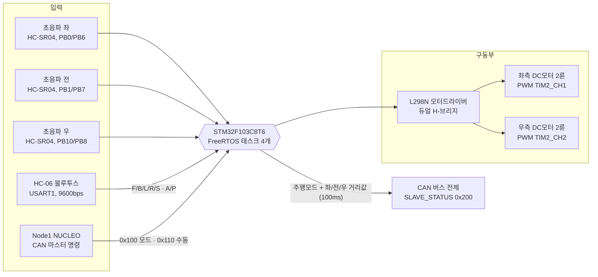
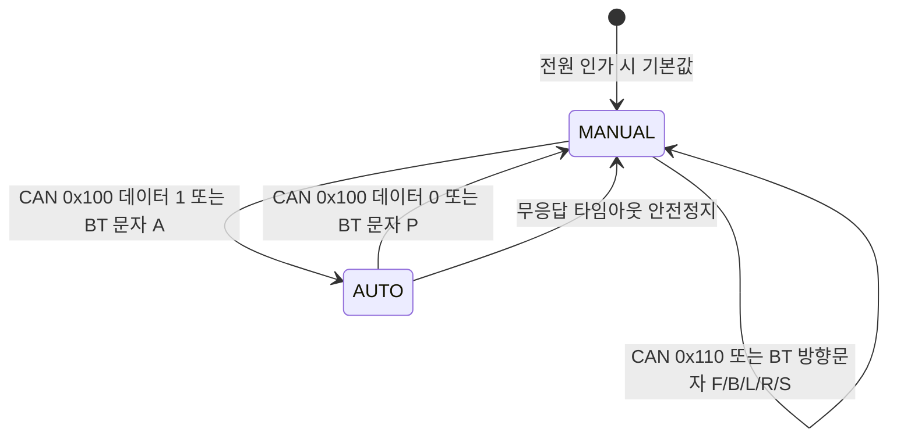
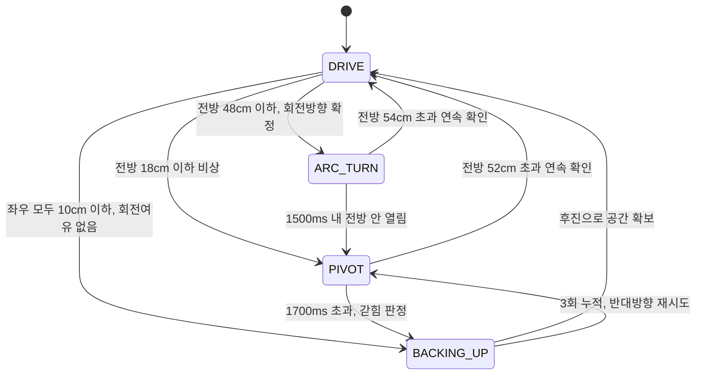

<div align="center">

# 🚗 STM32F103 자율주행 RC카 : CAN 기반 2-노드 분산 제어

### Ultrasonic Maze-Solving Autonomous Vehicle on FreeRTOS (Solo Project)

<br>


<br>


</div>
<br>

<!-- 사진/시연 영상 추후 첨부 예정 -->
<p align="center">
  <!-- 차량 실물 사진 추후 첨부 예정 -->
  <i>차량 실물 사진 · 미로 주행 사진 추후 첨부 예정</i>
</p>

<br>

초음파 센서 3개(좌·전·우)만으로 미로를 스스로 빠져나가는 **STM32F103 기반 자율주행 RC카**입니다. 4상태 논블로킹 FSM이 직선 주행·아크 선회·제자리 피벗·후진 회복을 상황에 따라 전환하며, **PD 제어 센터링**으로 통로 중앙을 유지하고 **회전 방향 투표(voting) 알고리즘**으로 초음파 난반사에 속아 U턴하는 오판을 막습니다. **FreeRTOS 태스크 4개**가 센서 트리거·주행 제어·CAN 송수신을 나눠 맡고, **CAN 2-노드 공유 버스**로 상위 마스터(NUCLEO)의 원격 모드 전환·수동 조작 명령을 받으며 자신의 상태와 거리값을 브로드캐스트합니다. 블루투스(HC-06)로 휴대폰에서 직접 수동 조종하는 경로도 함께 지원합니다.

> 이 저장소는 2-노드 CAN 시스템 중 **차량 제어 노드(Node2, STM32F103, 슬레이브)** 쪽입니다.
> Node1(NUCLEO 마스터)은 이 저장소 범위 밖입니다.

<br>

## 0. 목차

1. [시연](#1-시연)
2. [핵심 기술 요약](#2-핵심-기술-요약)
3. [프로젝트 개요](#3-프로젝트-개요)
4. [주요 기능](#4-주요-기능)
5. [자율주행 알고리즘 상세](#5-자율주행-알고리즘-상세)
6. [CAN 통신 상세](#6-can-통신-상세)
7. [시스템 구성](#7-시스템-구성)
8. [아키텍처](#8-아키텍처)
9. [핀맵](#9-핀맵)
10. [상태 전이](#10-상태-전이)
11. [실행 구조](#11-실행-구조)
12. [설계 포인트](#12-설계-포인트)
13. [Troubleshooting](#13-troubleshooting)
14. [한계 및 차기 프로젝트 반영](#14-한계-및-차기-프로젝트-반영)
15. [빌드](#15-빌드)

<br>

## 1. 시연

<!-- 시연 GIF·영상은 추후 첨부 예정 -->

전원을 켜면 차량은 **수동 모드로 대기**합니다. 휴대폰 블루투스 앱에서 'A'를 보내거나 상위 마스터가 CAN으로 자동 모드를 지시하면 자율주행이 시작되고, 차는 초음파 3개만으로 통로 중앙을 유지하며 미로를 통과합니다. 코너를 만나면 멈추지 않고 아크(호)를 그리며 돌고, 막다른 길에서는 제자리 피벗이나 후진으로 빠져나옵니다. 주행 중 언제든 'P'(블루투스) 또는 CAN 모드 명령으로 즉시 수동 조종으로 되돌릴 수 있습니다.

▶ **전체 시연 영상** : 추후 링크 첨부 예정 — 미로 자율주행, 코너 아크 선회, 막다른 길 후진 회복, 블루투스 수동 조종, CAN 원격 모드 전환

▶ **실측 성능 수치**(미로 통과 시간, 벽 충돌 횟수 등) : 추후 측정·정리 예정

<br>

## 2. 핵심 기술 요약

| 분류 | 핵심 기술 |
|---|---|
| **MCU** | STM32F103C8Tx (Blue Pill), ARM Cortex-M3, STM32Cube HAL 기반 |
| **RTOS** | FreeRTOS (CMSIS-RTOS v1) — 태스크 4개, 우선순위 분리, 뮤텍스·Mail Queue 사용 |
| **자율주행 FSM** | 4-state 논블로킹 상태머신 (DRIVE / ARC_TURN / PIVOT / BACKING_UP) |
| **제어 이론** | PD 제어 센터링(좌우 거리차 기반), 전방거리 비례 속도 조절, 조향 변화율 제한(slew) |
| **센서 신호처리** | 지수이동평균(EMA) 필터 + 비대칭 상승 제한 — 난반사 스파이크 차단, 위험 방향은 즉시 반영 |
| **판단 알고리즘** | 회전 방향 투표(voting) — 접근 구간 전체를 적분해 순간 오판으로 인한 U턴 방지 |
| **통신 (CAN)** | 2-노드 공유 CAN 버스 500kbps, ID 대역 분리(0x100/0x200), Mail Queue 기반 ISR 브릿지 |
| **통신 (BT)** | HC-06 블루투스 UART 9600bps, 인터럽트 수신 + 오버런(ORE) 자동 복구 |
| **모터 제어** | L298N 듀얼 H-브리지, TIM2 PWM 2채널(1kHz, duty 0~999)로 좌우 독립 속도 제어 |
| **거리 측정** | HC-SR04 3개, TIM4 Input Capture 3채널(1us 분해능)로 에코 펄스폭 직접 측정 |
| **안전 설계** | 명령 출처별 무응답 타임아웃(CAN 1s / BT 5s), 모드 전환 시 모터 정지 선행 |
| **구조** | AUTOSAR 스타일 4계층 아키텍처(ASW/RTE/BSW/Core), STM32CubeIDE 빌드 |

<br>

## 3. 프로젝트 개요

**인원** : 개인 프로젝트 | **MCU** : STM32F103C8Tx | **CubeMX** : 6.17.0 | **펌웨어 패키지** : STM32Cube FW_F1 V1.8.7

### 3-1. 프로젝트 일정

| 일정 | 단계 |
|---|---|
| 2026.06.15 | STM32CubeMX 프로젝트 생성 (핀 배치·주변장치 설정 확정) |
| 추후 정리 예정 | 4계층 아키텍처 구성 및 모터·초음파 드라이버 구현 |
| 추후 정리 예정 | 자율주행 FSM 및 PD 센터링 구현 |
| 추후 정리 예정 | CAN 2-노드 통신 및 FreeRTOS 태스크 분리 |
| 추후 정리 예정 | 주행 튜닝 (임계값·속도·게인 조정) |

> 커밋 이력이 남아 있지 않아 정확한 단계별 날짜는 확인할 수 없습니다. 확인 가능한 CubeMX 프로젝트 생성일만 사실로 기재하고, 나머지는 추후 정리 예정으로 남깁니다.

### 3-2. 담당 범위

개인 프로젝트로 하드웨어 배선부터 4계층 아키텍처 설계, 자율주행 FSM·PD 제어·투표 알고리즘 설계, CAN 통신 프로토콜 정의, FreeRTOS 태스크 분리, 실차 주행 튜닝까지 전 과정을 직접 진행했습니다. 2-노드 CAN 시스템 중 이 저장소는 **차량 제어 노드(Node2, 슬레이브)** 를 담당합니다.

<br>

## 4. 주요 기능

- **자율주행 (미로 통과)** : 초음파 3개 거리값만으로 4상태 FSM이 직선 주행·아크 선회·제자리 피벗·후진 회복을 판단해 전환합니다. 상세는 [5. 자율주행 알고리즘 상세](#5-자율주행-알고리즘-상세) 참고
- **통로 중앙 유지 (PD 센터링)** : 좌우 거리차를 오차로 삼아 좌우 바퀴 duty를 반대로 보정합니다. 비례항(P)이 중앙으로 되돌리고, 미분항(D)이 좌우로 흔들리는 위빙(weaving)을 감쇠시킵니다.
- **속도 자동 조절** : 전방이 열려 있으면 최고 속도, 코너가 가까워질수록 선형으로 감속해 코너 도착 전에 충분히 속도를 줄입니다.
- **블루투스 수동 조종** : HC-06으로 휴대폰 앱에서 'F'(전진)/'B'(후진)/'L'(좌회전)/'R'(우회전)/'S'(정지) 단일 문자를 받아 즉시 반영합니다.
- **모드 전환** : 'A'(자동) / 'P'(수동) 문자 또는 CAN 모드 명령(0x100)으로 전환합니다. **모드 문자는 현재 모드와 무관하게 항상 처리**되므로 자율주행 도중에도 즉시 수동으로 되돌릴 수 있습니다.
- **CAN 원격 제어 및 상태 보고** : 상위 마스터(NUCLEO)의 모드 전환·수동 조작 명령을 받고, 자신의 주행모드와 좌·전·우 거리값을 100ms 주기로 버스 전체에 브로드캐스트합니다.
- **무응답 안전 정지** : 명령 출처별로 기준 시간을 나눠(CAN 1000ms / 블루투스 5000ms) 그 시간 안에 새 명령이 없으면 모터를 강제 정지시킵니다.

<br>

## 5. 자율주행 알고리즘 상세

이 프로젝트의 핵심입니다. 거리 센서 3개라는 최소한의 정보만으로 미로를 통과해야 하므로, **"센서를 얼마나 믿을 것인가"** 와 **"언제 무엇으로 판단할 것인가"** 를 나눠 설계했습니다.

### 5-1. 4-state FSM

모든 상태 전환은 `HAL_Delay` 없이 경과시간 비교만으로 이뤄지며, 50ms 제어 주기마다 한 번씩 평가됩니다.

| 상태 | 역할 | 핵심 동작 | 주요 파라미터 |
|---|---|---|---|
| **DRIVE** | 직선 주행 | PD 센터링으로 통로 중앙 유지 + 전방거리 비례 속도 조절 | 기본속도 560 / 감속 430 / 최소 220 |
| **ARC_TURN** | 무정지 아크(호) 선회 | 바깥바퀴 고속·안쪽바퀴 저속으로 **멈추지 않고** 코너 통과 — 일반 코너의 기본 처리 | 바깥 520 / 안쪽 320, 최소 200ms · 최대 1500ms |
| **PIVOT** | 제자리 피벗 회전 | 좌우 바퀴를 반대로 돌려 그 자리에서 회전 — 막다른 코너·급접근 등 **비상시에만** | duty 420, 최소 150ms · 최대 1700ms 초과 시 갇힘 판정 |
| **BACKING_UP** | 연속 후진 회복 | 최후 수단. 뒤로 물러나 다시 시도 | duty 450, 250ms 단위, 3회 누적 시 반대방향 피벗 재시도 |

**코너를 "멈춰서 도는" 대신 "달리면서 도는" 이유** — 제자리 피벗은 확실하지만 매 코너마다 정지→회전→재출발을 반복해 느리고, 정지마찰을 다시 이겨내야 해서 바퀴가 헛돌기 쉽습니다. 그래서 일반 코너는 아크 선회로 매끄럽게 통과하고, 아크로도 못 도는 상황(전방 18cm 이하)에서만 피벗으로 넘어가도록 2단계로 나눴습니다.

### 5-2. 거리 임계값

| 임계값 | 값 | 의미 |
|---|---|---|
| 비상 (EMERGENCY) | 18cm | 아크로도 못 도는 상황 → 제자리 피벗 전환 |
| 코너 진입 (TURN_ENTER) | 48cm | 코너 도착 판정 → 아크 선회 시작 |
| 감속 시작 (SPEED_FULL) | 85cm | 이 값 이상이면 최고 속도, 48~85cm 구간은 선형 보간 감속 |
| 경고 (WARNING) | 30cm | 후진 회복 완료 판정 등 일반 경고 거리 |
| 측면 막힘 (SIDE_BLOCK) | 10cm | 좌·우가 모두 이 값 이하면 회전 여유조차 없음 → 후진 |
| 아크 종료 (ARC_EXIT) | 54cm | 전방이 이 값을 넘으면 선회 종료 |
| 피벗 종료 (PIVOT_EXIT) | 52cm | 전방이 이 값을 넘으면 회전 종료 |

**히스테리시스 설계** — 아크 종료(54cm)와 피벗 종료(52cm)는 **반드시 코너 진입(48cm)보다 커야** 합니다. 만약 종료 기준이 진입 기준보다 작으면, 선회를 끝낸 직후 DRIVE 상태가 곧바로 다시 "코너 도착"으로 판정해 선회를 재진입하고, 결과적으로 제자리에서 돌기만 반복하게 됩니다. 진입보다 각각 +6cm, +4cm 위에 두어 이 왕복을 차단했습니다.

### 5-3. 센서 필터링 — 지수이동평균(EMA)과 비대칭 상승 제한

초음파 센서는 벽에 비스듬히 부딪히면 반사파가 되돌아오지 못해(난반사) **실제로는 벽이 있는데 "뻥 뚫려 있다"고 보고**하는 순간 오류를 냅니다. 이 한 번의 오류가 그대로 판단에 들어가면 벽으로 돌진하게 됩니다.

- **지수이동평균(EMA)** : 새로 측정한 값을 그대로 쓰지 않고 직전까지의 값과 섞어 씁니다. 전방은 새 값을 **1/2** 반영(반응성 우선), 좌우는 **1/3** 반영(안정성 우선)합니다.
- **상승 제한 12cm/사이클** : 필터값이 한 번에 늘어날 수 있는 폭을 12cm로 제한해, "갑자기 100cm 뚫렸다"는 스파이크가 판단에 섞이지 않게 합니다.
- **비대칭 적용** : 단, **가까워지는 방향(거리가 줄어드는 쪽)은 제한 없이 즉시 반영**합니다. 위험 신호를 늦게 받아들이면 안 되기 때문에, 필터는 "안전해졌다"는 정보만 천천히 믿고 "위험해졌다"는 정보는 곧바로 믿습니다.

### 5-4. 회전 방향 투표(voting) 알고리즘

**문제** — 코너에 닿는 순간의 좌우 한 쌍만 보고 방향을 정하면, 그 한 번이 하필 난반사였을 때 반대로 돌아 **왔던 길로 U턴해 출발지로 돌아가버립니다.** 미로 주행에서 가장 치명적인 실패였습니다.

**해결** — 코너에 닿는 순간이 아니라 **접근하는 구간 전체를 누적**해서 방향을 정합니다.

| 파라미터 | 값 | 역할 |
|---|---|---|
| 투표 구간 (VOTE_CM) | 65cm | 전방이 이 값 미만으로 좁아지면 매 사이클 (좌−우)를 적분 시작 |
| 사이클당 기여 상한 (VOTE_CLAMP) | 25cm | 한 사이클이 점수를 독점하지 못하게 제한 |
| 신뢰 기준 (VOTE_TH) | 30 | 누적 점수의 절댓값이 이 값 이상일 때만 투표 결과를 신뢰 |
| 적분 조건 (VOTE_OPEN_CM) | 45cm | 좌·우 중 **한쪽이 45cm 이상 열렸을 때만** 적분 |
| 즉단 기준 (GAP_DECISIVE_CM) | 30cm | 현재 좌우차가 이 이상이면 누적 점수보다 현재값을 우선 |
| 방향 잠금 (DIR_LOCK_MS) | 800ms | 직전 회전 종료 후 이 시간 안에 재회전이 필요하면 같은 방향 유지 |

각 파라미터가 막는 실패는 서로 다릅니다.

- **적분 조건 45cm** — 통로 안에서 양쪽 벽이 13cm 대 26cm처럼 조금 비대칭인 것은 "어디로 돌지"의 근거가 아닙니다. 한쪽이 45cm 넘게 열렸을 때, 즉 **"입구가 보인다"는 신호일 때만** 점수에 반영합니다.
- **즉단 기준 30cm** — 좌우차가 30cm 이상 벌어졌다면 한쪽이 통로 입구처럼 확실히 열린 상황입니다. 상승 제한 필터를 이미 통과한 값이라 순간 난반사만으로는 이만큼 벌어질 수 없으므로, 이때는 누적 점수를 기다리지 않고 현재값을 따릅니다.
- **방향 잠금 800ms** — S자 미로의 연속된 코너 두 개는 항상 **같은 방향 회전 쌍**입니다. 두 번째 코너에서 방향을 새로 투표하다 뒤집히면 그대로 U턴이 되므로, 직전 회전 직후에는 재투표 없이 방향을 유지합니다.
- **방향 미확정 상태로 코너 도달 시** — 저속(duty 400)으로 기어가며(creep) 개방 신호를 기다리고, 전방이 26cm 이하로 좁아지면 더 기다리지 않고 그 시점의 최선의 정보로 회전 방향을 강제 확정합니다.

### 5-5. 튜닝 이력

초음파 트리거는 좌→전→우 순으로 한 번에 하나씩만 쏩니다(서로의 반사파를 잘못 받는 혼선을 막기 위함). 그래서 **전방 센서는 최악의 경우 약 195ms에 한 번만 갱신**되고, 그 사이 차는 계속 전진합니다. 이 갱신 지연 동안 전진하는 거리를 보상하기 위해, **임계값은 앞당기고 속도는 낮추는** 방향으로 일괄 재조정했습니다.

| 항목 | 변경 전 | 변경 후 | 이유 |
|---|---|---|---|
| 비상 거리 | 12cm | **18cm** | 센서 갱신 지연(195ms) 동안 전진하는 거리만큼 반응 시간 확보 |
| 코너 진입 | 36cm | **48cm** | "벽에 닿은 뒤 회전"하는 현상 제거 |
| 감속 시작 | 60cm | **85cm** | 코너 진입 상향에 비례해 감속 시작 지점도 앞당김 |
| 기본 주행속도 | 660 | **560** (약 15% 감속) | 전진 거리 자체를 줄여 정지거리 단축 |
| 아크 바깥바퀴 | 620 | **520** (약 15% 감속) | 선회 궤적을 줄여 반응 여유 확보 |
| 센터링 KP | 3 | **5** | 통로 한쪽 벽에 붙어 긁히는 현상 → 복원력 강화 |
| 센터링 KD | 20 | **28** | KP 상향에 맞춰 감쇠도 상향 — 위빙 없이 센터링만 빨라지게 |
| 보정 상한 | 110 | **140** | 게인만 올리고 상한을 두면 곧바로 클리핑돼 강화 효과가 사라짐 |
| 아크 종료 | 42cm | **54cm** | 코너 진입(48cm)보다 반드시 커야 재진입 반복이 없음 |
| 피벗 종료 | 40cm | **52cm** | 위와 같은 이유 |

> **KP만 올려선 안 되는 이유** — 게인(KP)을 올리면 보정량이 커지지만 상한(MAX_CORR)에 걸려 잘려나가면 실제 출력은 그대로입니다. 그리고 P만 올리면 중앙을 지나쳐 반대편으로 넘어가는 위빙이 심해지므로, 이를 억제하는 D(KD)도 함께 올려야 합니다. 세 값을 한 세트로 조정한 이유입니다.

<br>

## 6. CAN 통신 상세

### 6-1. 2-노드 구성

하나의 CAN 버스를 두 노드가 공유하며, **ID 대역으로 발신자를 구분**합니다. CAN은 주소가 아니라 메시지 ID로 통신하는 방식이라, 대역을 나눠두면 수신 측이 ID만 보고 누가 보낸 것인지 즉시 알 수 있습니다.

| 노드 | 장치 | 역할 | ID 대역 |
|---|---|---|---|
| **Node1** | NUCLEO | 마스터 — 모드 전환·수동 조작 명령 브로드캐스트 | 0x100 ~ 0x1FF |
| **Node2** | STM32F103 (**본 노드**) | 슬레이브 — 차량 제어, 상태·거리값 응답 | 0x200 ~ 0x2FF, 0x3F0 |

### 6-2. 통신 규격

| 항목 | 값 |
|---|---|
| 물리 계층 | CAN 트랜시버 경유 2선식 공유 버스 |
| 핀 | PA11 (CAN_RX) / PA12 (CAN_TX) |
| 통신 속도 | **500kbps** (PCLK1 36MHz ÷ 프리스케일러 4 ÷ 18TQ) |
| 비트 타이밍 | SJW 1TQ, BS1 15TQ, BS2 2TQ |
| 동작 모드 | Normal |
| 수신 처리 | RX FIFO0 인터럽트 → Mail Queue → CanRxTask |

### 6-3. CAN ID 맵과 구현 상태

| CAN ID | 이름 | 방향 | 구현 상태 |
|---|---|---|---|
| **0x100** | MASTER_MODE_CMD | Node1 → 전체 | 구현 — `data[0]`이 1이면 AUTO, 그 외는 MANUAL. **전환 시 항상 모터 정지를 먼저 수행** |
| **0x110** | MASTER_MANUAL_CMD | Node1 → 전체 | 구현 — `data[0]`에 'F'/'B'/'L'/'R'/'S' 방향 문자 |
| **0x200** | SLAVE_STATUS | 본 노드 → 전체 | 구현 — 100ms 주기, 주행모드 + 좌·전·우 거리값 |
| **0x3F0** | SLAVE_HEARTBEAT | 본 노드 → 전체 | **ID만 정의, 미구현** |

### 6-4. 메시지 포맷

**0x200 SLAVE_STATUS** (DLC 8, 100ms 주기 브로드캐스트)

| 바이트 | 내용 | 비고 |
|---|---|---|
| data[0] | 주행 상태 코드 | 0 = MANUAL / 1 = AUTO / 2 = FAULT |
| data[1] | 좌측 거리 (cm) | 255cm 초과 시 255로 포화 |
| data[2] | 전방 거리 (cm) | 255cm 초과 시 255로 포화 |
| data[3] | 우측 거리 (cm) | 255cm 초과 시 255로 포화 |
| data[4] | 롤링 카운터 | 송신할 때마다 1씩 증가 — 수신 측이 프레임 유실을 감지하는 용도 |
| data[5] | Fault 플래그 | 현재 0 고정, 추후 확장용 |
| data[6~7] | 예약 | 0 |

거리값을 1바이트로 담기 때문에 255cm에서 포화됩니다. 자율주행 판단 임계값이 최대 85cm이므로 제어에는 영향이 없고, 이 필드는 원격 모니터링 용도입니다.

**0x100 / 0x110 명령** — 두 메시지 모두 `data[0]` 1바이트만 사용합니다. 모드 명령은 1/0, 수동 명령은 방향 문자 1개로, 블루투스 명령과 동일한 표현을 써서 **두 경로가 같은 처리 함수로 합류**하도록 했습니다.

> 상태 코드 enum에는 `MCAL_CAN_STATE_FAULT`(2)가 정의돼 있지만 **현재 이 값을 설정하는 코드 경로는 없습니다.** 자체 진단으로 고장을 판정하는 로직이 아직 없기 때문이며, 실제로 브로드캐스트되는 값은 0 또는 1뿐입니다.
>
> `mcal_can.h`의 `MCAL_CAN_TIMEOUT_MASTER_MS`(1000ms)도 정의만 되어 있고, 실제 무응답 판정은 ASW 계층(`asw_manual_control`)의 자체 타임아웃이 담당합니다.

### 6-5. Mail Queue를 선택한 이유

CAN 수신 인터럽트가 받은 메시지를 태스크로 넘기는 다리 역할을, 일반적인 메시지 큐가 아니라 **Mail Queue**로 구현했습니다.

- **문제** : CMSIS-RTOS v1의 `osMessageQ`는 **32비트 값 하나(포인터 또는 정수)만** 전달할 수 있습니다. 그런데 넘겨야 할 CAN 메시지는 `{ id, dlc, data[8] }` 구조체 전체입니다.
- **포인터를 넘기면?** : ISR의 지역 변수 주소를 넘기면 ISR이 끝나는 순간 그 메모리는 무효가 되고, 별도 버퍼를 직접 관리하자니 ISR 안에서 안전한 메모리 할당이 필요합니다.
- **해결** : `osMailQ`는 **ISR에서 안전하게 쓸 수 있는 할당(alloc)과 넣기(put)** 를 제공하고, 구조체 전체를 값으로 복사해 전달합니다. ISR은 할당→복사→put만 하고 즉시 빠져나오며, 실제 처리는 `CanRxTask`가 담당합니다.

```
[CAN 수신 인터럽트]                    [CanRxTask]
 HAL_CAN_RxFifo0MsgPendingCallback      osMailGet (블로킹 대기)
   ├─ HAL_CAN_GetRxMessage (Read)              │
   ├─ osMailAlloc  (ISR-safe)                  │
   ├─ 구조체 복사                               ▼
   └─ osMailPut   ──────────────────►  ASW_Manual_ApplyCanCommand
        (여기까지가 ISR, 최소한만)            (ID별 라우팅·실제 처리)
```

**ISR 최소화 원칙** — 인터럽트 안에서 오래 머무르면 다른 인터럽트(특히 초음파 에코 캡처)를 놓칩니다. 그래서 ISR은 읽기와 큐 삽입만 하고, 모드 전환·모터 제어 같은 실제 처리는 전부 태스크로 넘겼습니다.

<br>

## 7. 시스템 구성



<br>

## 8. 아키텍처

AUTOSAR(차량용 소프트웨어 표준 구조)의 계층 개념을 참고해 **4계층**으로 나눴습니다. 핵심은 **"무엇을 할지 정하는 층(ASW)"과 "어떻게 할지 아는 층(BSW)"이 서로를 직접 부르지 않고, 중간의 RTE를 통해서만 대화한다**는 것입니다. 덕분에 ASW는 모터가 L298N인지, 센서가 HC-SR04인지 몰라도 됩니다.

```
┌──────────────────────────────────────────────────────┐
│                                                      │
│   ASW/    응용 소프트웨어 (주행 정책 · 판단)          │
│           asw_autonomous      자율주행 4-state FSM   │
│           asw_manual_control  수동주행 · 모드 전환    │
│                                                      │
├──────────────────────────────────────────────────────┤
│                                                      │
│   RTE/    런타임 환경 (계층 간 인터페이스)            │
│           rte_motor           주행 명령 추상화        │
│           rte_sensor          거리값 제공             │
│           rte_mode_manager    주행모드 중재 (Mutex)   │
│                                                      │
├──────────────────────────────────────────────────────┤
│                                                      │
│   BSW/    기반 소프트웨어                             │
│    ├ ECU_Abs/  부품 드라이버                          │
│    │    ecu_l298n     모터드라이버 제어               │
│    │    ecu_hcsr04    초음파 거리 측정                │
│    └ MCAL/     마이크로컨트롤러 추상화                 │
│         mcal_can       CAN 송수신 + Mail Queue 브릿지 │
│         mcal_bt_serial 블루투스 UART 인터럽트 수신    │
│                                                      │
├──────────────────────────────────────────────────────┤
│                                                      │
│   Core/   CubeMX HAL 초기화 + FreeRTOS                │
│           gpio · tim · usart · can · freertos · main  │
│                                                      │
└──────────────────────────────────────────────────────┘
```

**계층 분리의 실제 효과** — 예를 들어 `asw_autonomous`는 "왼쪽으로 아크 선회하라"는 의도만 `rte_motor`에 전달하고, 그것이 좌우 바퀴의 어떤 PWM duty와 어떤 방향 핀 조합으로 바뀌는지는 `ecu_l298n`이 혼자 압니다. 모터드라이버를 다른 부품으로 바꿔도 ASW 코드는 그대로입니다.

**명명 규칙** — 계층별로 함수 이름 앞머리를 고정해, 함수 이름만 봐도 어느 계층 코드인지 즉시 구분됩니다.

| 계층 | 규칙 | 예시 |
|---|---|---|
| ASW | `ASW_<Module>_<Verb><Object>()` | `ASW_Autonomous_ProcessControl()` |
| RTE | `RTE_<Module>_<Verb><Object>()` | `RTE_Sensor_GetDistance()` |
| BSW / ECU_Abs | `ECU_<Module>_<Verb><Object>()` | `ECU_HCSR04_...` |
| BSW / MCAL | `MCAL_<Module>_<Verb><Object>()` | `MCAL_CAN_Transmit()` |

```
Project03_Self-driving Car/
├── ASW/                          # 응용 소프트웨어 (주행 정책·판단)
│   ├── Inc, Src
│   │   ├── asw_autonomous        # 자율주행 4-state FSM, PD 센터링, 방향 투표
│   │   └── asw_manual_control    # 수동주행, CAN/BT 명령 처리, 모드 전환, 타임아웃
├── RTE/                          # 런타임 환경 (계층 간 인터페이스)
│   ├── Inc, Src
│   │   ├── rte_motor             # 주행 명령 추상화 (전진/후진/선회/정지)
│   │   ├── rte_sensor            # 초음파 트리거·거리값 제공
│   │   └── rte_mode_manager      # 주행모드 전역 상태 (Mutex 보호)
├── BSW/                          # 기반 소프트웨어
│   ├── ECU_Abs/Inc, Src
│   │   ├── ecu_l298n             # L298N 모터드라이버 (PWM duty + 방향 핀)
│   │   └── ecu_hcsr04            # HC-SR04 초음파 (Input Capture 펄스폭 → cm)
│   └── MCAL/Inc, Src
│       ├── mcal_can              # CAN 송수신, Mail Queue 브릿지, ISR 핸들러
│       └── mcal_bt_serial        # HC-06 UART 인터럽트 수신, 오버런 복구
├── Core/
│   ├── Inc, Src                  # CubeMX 생성 HAL 초기화, freertos.c, main.c
│   └── Startup                   # 스타트업 어셈블리
├── Drivers/                      # CMSIS + STM32F1xx HAL (표준 라이브러리)
├── Middlewares/                  # FreeRTOS (CMSIS-RTOS v1)
├── Project03_Self-driving_Car.ioc  # CubeMX 설정 파일
└── STM32F103C8TX_FLASH.ld        # 링커 스크립트
```

<br>

## 9. 핀맵

| 기능 | 핀 | 비고 |
|---|---|---|
| MOTOR_ENA_L | PA0 | TIM2_CH1 PWM — 좌측 모터 속도 |
| MOTOR_ENB_R | PA1 | TIM2_CH2 PWM — 우측 모터 속도 |
| MOTOR_IN1 / IN2 | PA2 / PA3 | GPIO 출력, 좌측 모터 방향 |
| MOTOR_IN3 / IN4 | PA4 / PA5 | GPIO 출력, 우측 모터 방향 |
| TRIG_LEFT / FRONT / RIGHT | PB0 / PB1 / PB10 | GPIO 출력, 초음파 트리거 |
| ECHO_LEFT / FRONT / RIGHT | PB6 / PB7 / PB8 | TIM4_CH1 / CH2 / CH3 Input Capture |
| USART1 TX / RX | PA9 / PA10 | HC-06 블루투스, 9600bps |
| CAN_RX / CAN_TX | PA11 / PA12 | 2-노드 CAN 버스, 500kbps |
| SWDIO / SWCLK | PA13 / PA14 | 디버그 (Serial Wire) |
| OSC_IN / OSC_OUT | PD0 / PD1 | 외부 크리스탈 |

**타이머 설정**

| 타이머 | 프리스케일러 | 주기(Period) | 용도 |
|---|---|---|---|
| TIM2 | 71 | 999 | 모터 PWM 1kHz, duty 범위 0~999 (예: duty 560 ≈ 56%) |
| TIM4 | 71 | 65535 | 초음파 Input Capture, 1카운트 = 1us 분해능 |

두 타이머 모두 프리스케일러 71을 써서 72MHz 클럭을 1MHz(1us)로 나눕니다. TIM4는 이 1us 눈금으로 에코 펄스의 폭을 직접 재고, 그 시간을 거리(cm)로 환산합니다.

<br>

## 10. 상태 전이

### 10-1. 주행 모드 전환 (수동 ↔ 자동)



모드 전환 시에는 **항상 모터 정지를 먼저 수행**한 뒤 새 모드로 넘어갑니다. 이전 모드의 마지막 명령이 새 모드에 잔류해 의도치 않게 움직이는 것을 막기 위함입니다. 또한 모드 전환 문자('A'/'P')와 CAN 모드 명령은 **현재 모드와 무관하게 항상 처리**되므로, 자율주행 중에도 즉시 사람이 개입해 수동으로 되돌릴 수 있습니다.

### 10-2. 자율주행 FSM (4-state)



핵심 흐름은 **DRIVE → ARC_TURN → DRIVE** 입니다. 대부분의 코너는 아크 선회만으로 통과하고, PIVOT과 BACKING_UP은 아크로 해결되지 않을 때만 순차적으로 동원되는 회복 경로입니다. 각 상태의 종료 판정에는 **연속 확인(2사이클)** 을 요구해, 한 번의 스파이크로 상태가 튀지 않도록 했습니다.

<br>

## 11. 실행 구조

FreeRTOS(CMSIS-RTOS v1) 위에서 태스크 4개가 동작합니다. `HAL_Delay`는 전면 배제하고 `osDelay`로만 주기를 만들어, 한 태스크가 기다리는 동안 다른 태스크가 CPU를 쓸 수 있게 했습니다.

### 11-1. 태스크 구성

| 태스크 | 우선순위 | 스택 | 주기 | 역할 |
|---|---|---|---|---|
| **CanRxTask** | osPriorityHigh | 256 | Mail Queue 블로킹 대기 | CAN 수신 메시지를 ID별로 라우팅 |
| **CtrlTask** | osPriorityAboveNormal | 256 | 50ms | 주행 제어 메인 — 거리값 갱신 후 자율/수동으로 분기 |
| **TrigTask** | osPriorityNormal | 128 | 좌→전→우 순환 (센서당 최대 65ms) | 초음파 트리거 송출 |
| **CanTxTask** | osPriorityLow | 128 | 100ms | SLAVE_STATUS(0x200) 브로드캐스트 |

### 11-2. 우선순위를 이렇게 준 이유

- **CanRxTask가 가장 높은 이유** : 대부분의 시간을 큐 대기로 잠들어 있어 CPU를 전혀 쓰지 않습니다. 하지만 마스터의 모드 전환 명령(특히 **자율주행 중단**)은 안전과 직결되므로, 도착하는 즉시 깨어나 처리해야 합니다. "평소엔 놀고, 올 때만 최우선"이라 높은 우선순위를 줘도 다른 태스크를 굶기지 않습니다.
- **CtrlTask가 그다음인 이유** : 50ms 제어 주기를 안정적으로 지켜야 FSM의 시간 계산과 PD 제어의 미분항이 정확해집니다. 주기가 밀리면 제어 품질이 그대로 떨어집니다.
- **CanTxTask가 가장 낮은 이유** : 상태 보고는 모니터링 용도라 100ms가 조금 밀려도 주행에 영향이 없습니다. 남는 시간에 처리하면 충분합니다.

### 11-3. 초음파 트리거 순환

초음파 3개를 동시에 쏘면 서로의 반사파를 잘못 받아 거리값이 뒤엉킵니다. 그래서 **한 번에 하나씩** 좌→전→우 순서로 돌아가며 쏩니다.

```
TrigTask (무한 반복)
 ├─ 좌 트리거 → 에코 수신될 때까지 대기 (상한 65ms)
 ├─ 전 트리거 → 에코 수신될 때까지 대기 (상한 65ms)
 └─ 우 트리거 → 에코 수신될 때까지 대기 (상한 65ms)
```

대기 시간은 고정 65ms가 아니라 **에코가 실제로 돌아온 즉시 다음 센서로 넘어가는** 구조입니다. 초음파 왕복시간은 거리에 비례하므로(20cm면 약 1ms), **가까운 벽일수록 갱신이 오히려 빨라집니다** — 위험할수록 센서가 빨라지는 셈입니다. 65ms는 장애물이 없어 에코가 영영 돌아오지 않는 경우를 위한 **상한(타임아웃 안전장치)** 으로만 남겨뒀습니다.

따라서 **한 바퀴 195ms는 최악의 경우**이고, 실제 미로 주행처럼 벽이 가까운 환경에서는 이보다 훨씬 빠르게 순환합니다. 다만 [5-5 튜닝 이력](#5-5-튜닝-이력)의 임계값·속도 조정은 이 **최악의 경우(195ms)를 기준으로 안전하게 설정**했습니다.

### 11-4. 공유 자원 보호

| 공유 자원 | 보호 방식 | 이유 |
|---|---|---|
| 주행 모드 (수동/자동) | `DriveModeMutex` 뮤텍스 | CanRxTask(쓰기)와 CtrlTask·CanTxTask(읽기)가 동시에 접근 |
| 좌·전·우 거리값 | `volatile` 전역 | CtrlTask가 쓰고 CanTxTask가 읽기만 함 — 1워드 단위 접근이라 뮤텍스 불필요 |
| CAN 수신 메시지 | `osMailQ` Mail Queue | ISR과 태스크 간 구조체 전달 (6-5 참고) |

<br>

## 12. 설계 포인트

- **논블로킹 원칙 관철** : `HAL_Delay`를 코드 전체에서 배제하고 `osDelay`로 통일했습니다. 한 태스크가 지연으로 멈춰 있는 동안에도 다른 태스크가 정상 동작해야 하기 때문입니다.
- **ISR은 최소한만** : CAN 수신 ISR은 읽기와 큐 삽입만, 블루투스 수신 ISR은 1바이트 보관만 수행합니다. 인터럽트 안에서 오래 머물면 초음파 에코 캡처처럼 시간에 민감한 다른 인터럽트를 놓칩니다.
- **명령 경로 통합** : CAN 수동 명령(0x110)과 블루투스 명령이 동일한 문자 표현('F'/'B'/'L'/'R'/'S')을 쓰도록 맞춰, 두 경로가 같은 처리 함수로 합류합니다. 경로별로 로직이 갈라지지 않아 동작 불일치가 생기지 않습니다.
- **모드 전환 시 모터 정지 선행** : 이전 모드의 마지막 명령이 새 모드에 잔류하지 않도록, 어떤 경로의 전환이든 정지를 먼저 수행합니다.
- **안전 개입은 항상 유효** : 모드 전환 명령은 현재 모드와 무관하게 항상 처리됩니다. 자율주행이 오작동하는 상황에서 "자율주행 중이라 수동 명령을 무시"하면 사람이 개입할 방법이 사라지기 때문입니다.
- **필터의 비대칭성** : "안전해졌다"는 정보는 천천히 믿고(상승 제한 12cm), "위험해졌다"는 정보는 즉시 믿습니다(제한 없음). 필터의 목적이 노이즈 제거이지 위험 신호 지연이 아니기 때문입니다.
- **히스테리시스로 상태 진동 차단** : 선회 종료 기준을 진입 기준보다 크게 두어(54 vs 48, 52 vs 48), 상태가 경계에서 왕복하며 제자리에 갇히는 현상을 막았습니다.
- **순간이 아닌 구간으로 판단** : 회전 방향을 코너 도착 순간이 아니라 접근 구간 전체의 적분값으로 결정해, 센서 한 번의 오류가 주행 전체를 망치지 않게 했습니다.
- **오버런(ORE) 자동 복구** : UART 수신 에러가 나면 HAL이 수신을 중단해버려 이후 바이트가 영영 들어오지 않습니다. `MCAL_BtSerial_HandleErrorIsr()`이 에러 플래그를 지우고 수신을 재등록해 자동 복구합니다.
- **소비형 읽기** : `MCAL_BtSerial_GetChar()`는 읽는 순간 내부 플래그를 리셋해 **같은 명령을 두 번 반환하지 않습니다.** 한 번 누른 버튼이 반복 실행되는 것을 방지합니다.
- **계층 간 의존 방향 고정** : ASW는 RTE만 호출하고 BSW를 직접 부르지 않습니다. 부품이 바뀌어도 주행 정책 코드는 건드리지 않아도 됩니다.

<br>

## 13. Troubleshooting

### 13-1. 블루투스 연결 끊김 시 안전정지 미동작

- **증상** : 방향키 버튼을 계속 누르고 있어도 약 3초 뒤 차가 스스로 멈추는 문제가 있어, 시리얼(BT) 출처 명령에는 CAN과 같은 타임아웃 검사를 적용하지 않도록 고쳤습니다. 그러자 이번에는 BT 연결이 끊기거나 휴대폰 앱이 다운돼도 차가 마지막 방향으로 멈추지 않고 계속 달리는 문제가 새로 생겼습니다.
- **원인** : `ASW_Manual_IsCommandTimeout()`이 `s_cmdSource == ASW_MANUAL_CMD_SOURCE_CAN`일 때만 타임아웃을 검사하도록 되어 있어, SERIAL 출처 명령은 무응답 감지 자체가 없었습니다.
- **수정 전** : CAN 출처가 아니면 곧바로 0을 반환해, BT 명령으로 주행 중에는 어떤 경우에도 안전 정지가 걸리지 않았습니다.

```c
uint8_t ASW_Manual_IsCommandTimeout(void)
{
    if (s_cmdSource != ASW_MANUAL_CMD_SOURCE_CAN)
    {
        return 0u;
    }

    return ((osKernelSysTick() - s_lastRxTick) > ASW_MANUAL_CMD_TIMEOUT_MS) ? 1u : 0u;
}
```

- **수정 후** : 명령 출처별로 기준 시간을 나눠, CAN은 기존과 동일한 1000ms를 유지하고 SERIAL에는 새로 정의한 `ASW_MANUAL_SERIAL_SILENCE_MS`(5000ms)를 적용했습니다. 출처가 없는 상태(NONE)는 기존처럼 검사하지 않습니다.

```c
#define ASW_MANUAL_CMD_TIMEOUT_MS    1000u  /* CAN 명령 미수신 안전정지 기준 */
#define ASW_MANUAL_SERIAL_SILENCE_MS 5000u  /* BT 무응답(연결끊김/앱다운) 시 강제정지 기준 */

uint8_t ASW_Manual_IsCommandTimeout(void)
{
    uint32_t limit_ms;

    if (s_cmdSource == ASW_MANUAL_CMD_SOURCE_CAN)
    {
        limit_ms = ASW_MANUAL_CMD_TIMEOUT_MS;
    }
    else if (s_cmdSource == ASW_MANUAL_CMD_SOURCE_SERIAL)
    {
        limit_ms = ASW_MANUAL_SERIAL_SILENCE_MS;
    }
    else
    {
        return 0u; /* 출처 없음(NONE) : 타임아웃 검사 대상 아님 */
    }

    return ((osKernelSysTick() - s_lastRxTick) > limit_ms) ? 1u : 0u;
}
```

- **결과** : BT 연결이 끊기거나 앱이 다운돼도 5초 안에는 모터가 강제 정지하게 되어, 차가 마지막 방향으로 무한히 달리는 최악의 상황은 막았습니다. 다만 앱이 버튼을 누르는 동안 방향 문자를 반복 전송하지 않는 구조라, 정상적으로 5초 넘게 누르고 있어도 정지하게 되므로 완벽한 해결책은 아닙니다. 향후 과제로 앱이 주기적으로 heartbeat 또는 방향 문자를 재전송하도록 개선하거나, BT 모듈의 STATE 핀을 GPIO로 읽어 하드웨어 레벨에서 연결 끊김을 감지하는 방안이 남아 있습니다.

<br>

## 14. 한계 및 차기 프로젝트 반영

| # | 한계 | 현재 상태 | 개선 방향 |
|---|---|---|---|
| **1** | **printf와 블루투스가 USART1 공유** | 이 프로젝트는 **USART1 하나만 설정되어 있어 별도 디버그 UART가 없음**. `printf` 출력이 `huart1`으로 나가는데 이것이 HC-06과 같은 포트라, **디버그 로그가 휴대폰 앱으로 전송됨**. 게다가 9600bps에서 한 줄(약 30바이트)에 30ms 넘게 블로킹 송신하므로 50ms 제어주기를 심하게 잠식. 현재는 디버그 관찰을 STM32CubeIDE **Live Expressions**로 대체 중 | USART2를 디버그 전용으로 분리하거나, SWO(Serial Wire Output) 트레이스로 로그 경로를 완전히 분리. 로그 자체도 블로킹 송신 대신 DMA·인터럽트 기반 링버퍼로 전환 |
| **2** | **전방 센서 갱신 지연** | 초음파 트리거가 좌→전→우 순환이라 **전방 센서는 최악의 경우 195ms에 한 번만 갱신**. 현재는 임계값을 앞당기고 속도를 약 15% 낮춰 보상 중이며, 에코 수신 즉시 다음 센서로 넘어가는 조기 전환으로 평균 주기는 단축한 상태 | 전방 센서를 증설해 좌우와 인터리빙(교차 배치)하거나, 트리거 주파수·설치 각도를 달리해 혼선 없이 동시 측정. 또는 ToF(레이저 거리) 센서로 교체해 갱신 주기 자체를 단축 |
| **3** | **FAULT 상태코드·하트비트 미사용** | `MCAL_CAN_STATE_FAULT`(2)가 enum에 정의만 되어 있고 **이 값을 설정하는 코드 경로가 없음**. 실제 브로드캐스트되는 값은 MANUAL(0)/AUTO(1)뿐이며, `SLAVE_STATUS`의 Fault 플래그 바이트(data[5])도 0 고정. 생존 신호 `SLAVE_HEARTBEAT`(0x3F0)도 **ID만 정의되고 송신 코드가 없음** | 센서 무응답·모터 무반응·CAN 버스오프 등 자체 진단 항목을 정의하고, 감지 시 FAULT로 전환해 상위 노드에 보고. 하트비트(0x3F0)를 주기적으로 송신해 마스터가 노드 생존을 감시하도록 추가. 정의만 되고 쓰이지 않는 `MCAL_CAN_TIMEOUT_MASTER_MS`도 이 진단 로직에 연결 |

> 위 3가지는 모두 **"동작은 하지만 설계 의도까지는 도달하지 못한"** 부분들입니다. 특히 1번(디버그 UART 부재)은 개발 초기 핀 배치 단계에서 디버그 경로를 확보해두지 않으면 나중에 되돌리기 어렵다는 점을, 2번(센서 갱신 지연)은 센서 구성이 제어 알고리즘의 상한을 결정한다는 점을 확인한 사례로, 차기 프로젝트의 초기 설계 체크리스트에 반영할 항목입니다.

<br>

## 15. 빌드

STM32CubeIDE 프로젝트로, GCC 기반 GNU Tools for STM32 툴체인을 사용합니다.

**STM32CubeIDE (권장)**

1. STM32CubeIDE에서 `File > Import > Existing Projects into Workspace`로 프로젝트 폴더 선택
2. 프로젝트 우클릭 → `Build Project` (또는 Ctrl+B)
3. ST-Link로 보드 연결 후 `Run` 또는 `Debug`로 플래시

**커맨드라인 (Make, GNU Tools for STM32 설치 후)**

```bash
cd Debug
make -j
```

**디버그 관찰** — 별도 디버그 UART가 없으므로([14. 한계](#14-한계-및-차기-프로젝트-반영) 1번 참고), 주행 중 내부 변수는 STM32CubeIDE의 **Live Expressions** 창에서 관찰합니다. 주요 관찰 대상은 `mcal_bt_serial.c`의 수신 카운터(`s_rxCount` / `s_errCount`)와 자율주행 FSM의 현재 상태·필터 거리값입니다.

빌드 산출물 : `Debug/Project03_Self-driving Car.elf`, `.map`, `.list`
